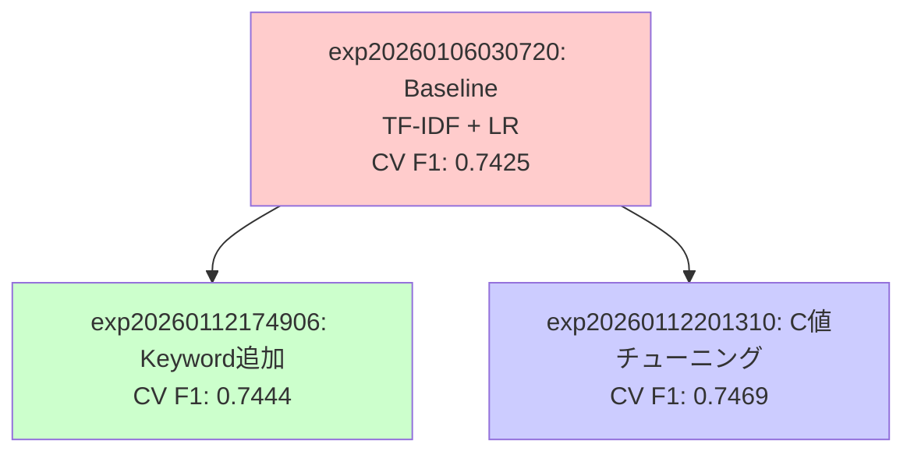

# 実験・結果管理 (Experiments & Results)

## 概要

各実験は一意のIDで管理され、コード、結果、メタデータが体系的に保存されます。画像で示されたディレクトリ構造を採用します。

## 実装済み機能

### ディレクトリ構造（詳細版）

```
project/
├── experiments/              # 実験ごとのコード管理
│   ├── _template_experiment/  # 実験テンプレート
│   │   ├── config.yaml
│   │   └── README.md
│   │
│   ├── exp20260106030720_baseline_tfidf_lr/  # 実験ID: exp20260106030720
│   │   ├── exp20260106030720_config.yaml     # パラメータ設定
│   │   ├── exp20260106030720_train.py        # 学習コード
│   │   └── exp20260106030720_predict.py      # 推論コード
│   │
│   ├── exp20260112174906_keyword_tfidf_lr/   # 実験ID: exp20260112174906
│   │   ├── exp20260112174906_config.yaml
│   │   ├── exp20260112174906_train.py
│   │   └── exp20260112174906_predict.py
│   │
│   └── exp20260112201310_lr_c_tuning/        # 実験ID: exp20260112201310
│       ├── exp20260112201310_config.yaml
│       ├── exp20260112201310_train.py
│       └── exp20260112201310_predict.py
│
└── results/                 # 実験ごとの出力結果
    ├── exp20260106030720_baseline_tfidf_lr/  # 実験ID: exp20260106030720 の結果
    │   ├── exp20260106030720_submission.csv  # 提出用予測
    │   ├── exp20260106030720_model.pkl       # 学習済みモデル
    │   ├── exp20260106030720_metrics.json    # 評価指標
    │   ├── exp20260106030720_cv_results.json # クロスバリデーション結果
    │   └── exp20260106030720_report.md       # 実験レポート
    │
    ├── exp20260112174906_keyword_tfidf_lr/   # 実験ID: exp20260112174906 の結果
    │   ├── exp20260112174906_submission.csv
    │   ├── exp20260112174906_model.pkl
    │   ├── exp20260112174906_metrics.json
    │   ├── exp20260112174906_cv_results.json
    │   └── exp20260112174906_report.md
    │
    └── exp20260112201310_lr_c_tuning/        # 実験ID: exp20260112201310 の結果
        ├── exp20260112201310_submission.csv
        ├── exp20260112201310_model.pkl
        ├── exp20260112201310_metrics.json
        ├── exp20260112201310_cv_results.json
        ├── exp20260112201310_c_search.json   # ハイパーパラメータ探索結果
        └── exp20260112201310_report.md
```

### 実験IDの命名規則

**基本形式**: `exp[YYYYMMDDHHMMSS]_[short-description]` (タイムスタンプ形式)

**実装例**:
- `exp20260106030720_baseline_tfidf_lr`: 初回ベースライン（TF-IDF + Logistic Regression）
- `exp20260112174906_keyword_tfidf_lr`: keyword特徴量追加版
- `exp20260112201310_lr_c_tuning`: Logistic RegressionのCパラメータチューニング

**命名規則の詳細**:
- タイムスタンプ: `YYYYMMDDHHMMSS` 形式（年4桁、月2桁、日2桁、時2桁、分2桁、秒2桁）
- 説明: アンダースコア区切りで実験の内容を簡潔に記述
- 例: `exp20260106030720_baseline_tfidf_lr` = 2026年1月6日3時7分20秒に作成されたベースライン実験（TF-IDF + LR）

**注意**: 初期設計では `exp001` 形式を想定していたが、実装ではタイムスタンプ形式を採用。これにより、実験の作成時刻がIDから判別可能になり、時系列での管理が容易になる。

### config.yaml テンプレート

```yaml
# experiments/expYYYYMMDDHHMMSS_[description]/expYYYYMMDDHHMMSS_config.yaml

experiment:
  id: "expYYYYMMDDHHMMSS"  # タイムスタンプ形式（例: exp20260106030720）
  name: "[description]"
  description: "[詳細な説明]"
  created_at: "YYYY-MM-DDTHH:MM:SS"
  parent_experiment: null  # 派生元の実験ID（初回はnull）
  tags:
    - baseline

data:
  train_path: "data/raw/train.csv"  # リポジトリルート基準の相対パス
  test_path: "data/raw/test.csv"
  # processed_path: "data/processed/expYYYYMMDDHHMMSS/"

preprocessing:
  # NLP用
  lowercase: true
  remove_urls: true
  remove_mentions: true
  remove_hashtags: false
  remove_emojis: false
  # 汎用
  missing_value_strategy: "median"  # or: mean, mode, drop

feature_engineering:
  type: "tfidf"  # or: count, embeddings, transformers
  params:
    max_features: 10000
    ngram_range: [1, 2]
    min_df: 2

model:
  type: "LogisticRegression"  # or: LinearSVC, XGBoost, LightGBM, BERT
  params:
    C: 1.0
    max_iter: 1000
    random_state: 42

validation:
  method: "stratified_kfold"  # or: kfold, holdout
  n_folds: 5
  shuffle: true
  random_state: 42

output:
  results_dir: "./results/"
  save_model: true
  save_predictions: true
  save_plots: false

seed: 42
```

### metrics.json テンプレート（実装例）

**用途**: 実験結果の評価指標を保存するJSONファイル。以下の目的で使用されます：

1. **実験レポート作成**: Validatorエージェントが実験レポート（`report.md`）を作成する際に参照
2. **結果の比較**: 複数の実験結果を比較して、最良モデルを特定
3. **Git管理**: 軽量な結果ファイルとしてGitにコミット（実験の再現性確保）
4. **Public LBスコアの追記**: Kaggle提出後のPublic LBスコアを手動で追記
5. **知識ベースへの反映**: 実験結果を知識ノート（Zettelkasten）に反映する際のデータソース

**実装済みの構造**: 実験の種類（分類/回帰）や目的に応じて柔軟な構造を採用。

**分類タスクの例**（Disaster Tweets）:
```json
{
  "experiment_id": "exp20260106030720",
  "train_f1": 0.8542,
  "cv_mean": 0.7425,
  "cv_std": 0.0137,
  "cv_scores": [0.7587, 0.7444, 0.7178, 0.7411, 0.7506],
  "public_lb": 0.80079
}
```

**ハイパーパラメータチューニングを含む例**:
```json
{
  "experiment_id": "exp20260112201310",
  "best_C": 5.0,
  "train_f1": 0.9408,
  "cv_mean": 0.7469,
  "cv_std": 0.0100,
  "cv_scores": [0.7516, 0.7568, 0.7282, 0.7461, 0.7516],
  "train_cv_gap": 0.1940,
  "c_search_results": [
    {
      "C": 1.0,
      "cv_mean": 0.7425,
      "cv_std": 0.0137,
      "train_f1": 0.8542,
      "train_cv_gap": 0.1117
    },
    {
      "C": 5.0,
      "cv_mean": 0.7469,
      "cv_std": 0.0100,
      "train_f1": 0.9408,
      "train_cv_gap": 0.1940
    }
  ],
  "public_lb": 0.80202
}
```

**注意**: 
- メトリクスの構造は実験の種類（分類/回帰）や目的に応じて柔軟に変更可能
- 回帰タスクの場合は `rmse`, `mae`, `r2` などを使用
- 分類タスクの場合は `f1`, `accuracy`, `precision`, `recall` などを使用
- ハイパーパラメータチューニングの結果も必要に応じて含める

### 実験の系統樹管理（Obsidian Graph View活用）

### 派生関係の記録方法

各実験の`config.yaml`の`parent_experiment`フィールドに親実験IDを記載。また、実験レポート（`report.md`）に親実験へのリンクを記載：

```markdown
# Experiment: exp20260112174906 - keyword特徴量追加

## 実験概要
- 実験ID: exp20260112174906
- 親実験: exp20260106030720（ベースライン）
- 実施日: 2026-01-12

## このexperimentで試したこと
- keyword特徴量の追加
- TF-IDF特徴量との組み合わせ

## 結果
CV F1: 0.7425 → 0.7444 (改善!)

## 派生先
- exp20260112201310: LogisticRegressionのC値チューニング
```

### Obsidian Graph View での可視化



**実装方法**:
1. 各実験の`config.yaml`の`parent_experiment`フィールドに親実験IDを記載
2. 実験レポート（`report.md`）に親実験へのWikilinks形式でリンクを記述
3. Obsidianが自動的にグラフを生成
4. タグ `#best-score` で最良モデルをマーキング

### 実験テンプレート自動生成スクリプト ⏳ **未実装**

実験テンプレートの自動生成スクリプトは現在未実装です。新規実験の作成時は、`experiments/_template_experiment/`をコピーして手動で作成します。

**将来実装予定の機能**:
- `scripts/workflow/create_experiment.py`: タイムスタンプ形式の実験IDでディレクトリとテンプレートファイルを自動生成（将来実装）
- 親実験からの`config.yaml`継承機能
- 実験ディレクトリ名の自動生成（`expYYYYMMDDHHMMSS_[description]`）

## 関連ドキュメント

- [プロジェクトアーキテクチャ](../project_architecture.md) - システム設計の概要
- [システム概要](../system_overview.md) - システム全体の概要
- [知識・タスクデータベース](./knowledge_database.md) - 知識管理システムの詳細
- [JSON形式タスク管理システム](./task_management.md) - タスク管理システムの詳細
- [マルチエージェントシステム](./multi_agent_system.md) - エージェントシステムの詳細

