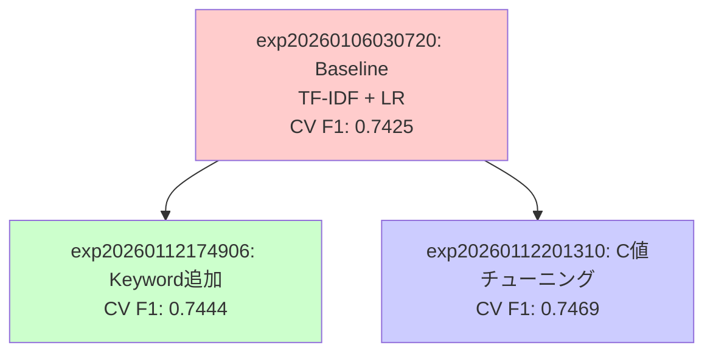

# 実験・結果管理

## 概要

各実験は一意のIDで管理され、実験に使用した学習・推論コードは `experiments/` ディレクトリに、結果、メタデータは `results/` ディレクトリに保存されます。
各ファイルは指定のエージェントによって生成・管理します。

## ディレクトリとファイル構成

### ディレクトリ構造

```
project/
├── experiments/              # 実験ごとのコード管理
│   ├── _template_experiment/ # 実験テンプレート (コピー元して使用)
│   │   ├── config.yaml       # 設定ファイル
│   │   └── README.md         # 実験の説明・手順
│   │
│   └── exp20260106030720_baseline_tfidf_lr/  # 実験ID: exp20260106030720
│       ├── config.yaml     # パラメータ設定
│       ├── train.py        # 学習コード
│       └── predict.py      # 推論コード
│
└── results/                  # 実験ごとの出力結果
    ├── _template_experiment/ # 実験テンプレート (コピー元して使用)
    │   ├── report.md         # 実験レポート
    │   ├── metrics.json      # 評価指標
    │   ├── cv_results.json   # CV結果
    │   ├── submission.csv    # 提出ファイル
    │   └── model.pkl         # モデルファイル
    │
    └── exp20260106030720_baseline_tfidf_lr/  # 実験ID: exp20260106030720 の結果
        ├── submission.csv  # 提出用予測
        ├── model.pkl       # 学習済みモデル
        ├── metrics.json    # 評価指標
        ├── cv_results.json # クロスバリデーション結果
        └── report.md       # 実験レポート
```

### 各ファイルの説明

- **report.md**
  - **作成者**: Validatorエージェント
  - **内容**: 実験の詳細レポート（YAMLフロントマター + Markdown）
  - **用途**: 実験結果の記録、知識ベースへの反映
- **metrics.json**
  - **作成者**: Developerエージェント（train.py実行時）
  - **内容**: 評価指標（train_f1, cv_mean, cv_std, public_lb等）
  - **用途**: 実験結果の比較、Git管理対象
- **cv_results.json**
  - **作成者**: Developerエージェント（train.py実行時）
  - **内容**: 各フォールドのCVスコア
  - **用途**: CV結果の詳細分析
- **submission.csv**
  - **作成者**: Developerエージェント（predict.py実行時）
  - **内容**: Kaggle提出用の予測結果
  - **用途**: Kaggleへの提出
- **model.pkl**
  - **作成者**: Developerエージェント（train.py実行時）
  - **内容**: 学習済みモデル
  - **用途**: 推論時のモデル読み込み（Git管理対象外）

## 詳細な規則

基本的には元とするテンプレートファイルに記載ルールがありますが、以下に補足説明を記載します。

### 実験IDの命名規則

- `YYYYMMDDHHMMSS`: タイムスタンプ
- `short-description`: アンダースコア区切りで実験の内容を簡潔に記述
- 例: `exp20260106030720_baseline_tfidf_lr` = 2026年1月6日3時7分20秒に作成されたベースライン実験（TF-IDF + LR）

### metrics.json の詳細

- メトリクスの構造は実験の種類（分類/回帰）や目的に応じて柔軟に変更可能
- 回帰タスクの場合は `rmse`, `mae`, `r2` などを使用
- 分類タスクの場合は `f1`, `accuracy`, `precision`, `recall` などを使用
- ハイパーパラメータチューニングの結果も必要に応じて含める

### 実験の系統樹管理

ある実験から更に派生の実験を派生させたときは Obsidian Graph View を活用して系統樹を可視化します。


