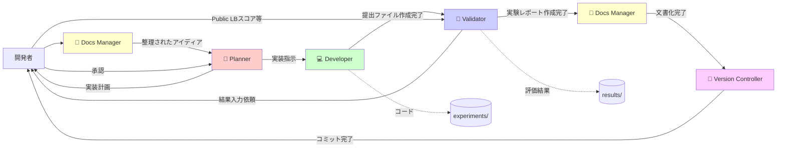
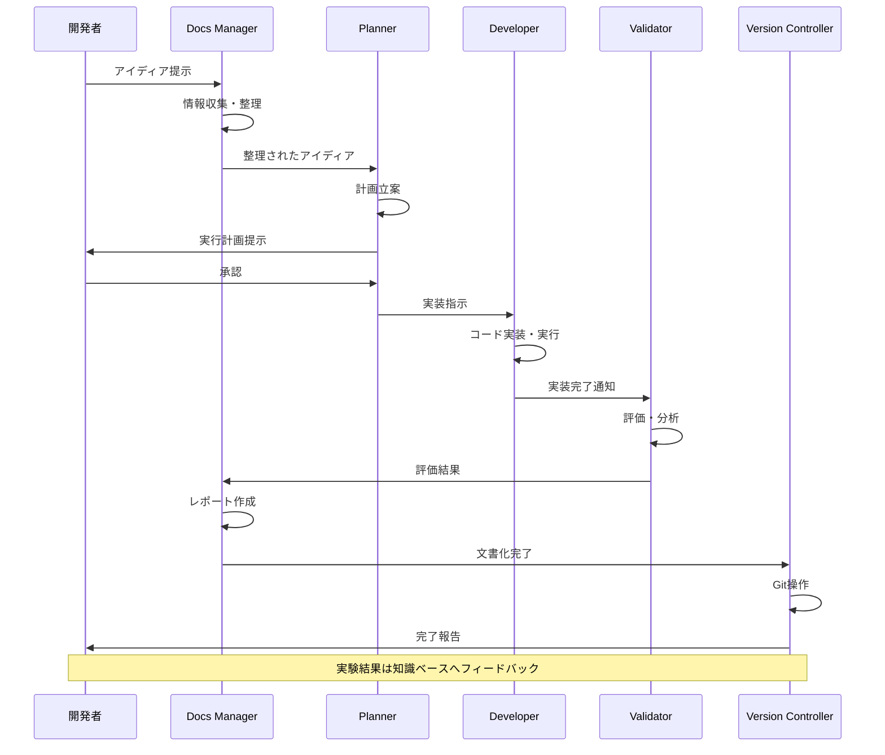

# マルチエージェントシステム

## 概要

Cursor/VSCode内で動作する5つの専門AIエージェントが協調して実験を実行します。各エージェントは明確に定義された役割を持ち、他のエージェントの領域に侵入しません。

## 実装済み機能

### エージェント構成図



### エージェント詳細仕様

### 1. 🧠 Planner (指揮官)

**役割**: 論理的な実行計画の立案、タスク分解、専門エージェントへの委譲

**入力**:
- `tasks/current_sprint.json`からのタスクJSON
- Docs Managerからの整理されたアイディア

**処理**:
1. タスクの目的と仮説を明確化
2. 具体的な実装手順を立案
3. 期待される成果を定量化
4. リスク要因と対策を特定
5. 適切なエージェントに作業を割り当て

**出力形式**:
```
[Plan:]
- 実装の目的: TF-IDF + LogisticRegressionベースラインモデルの構築
- 仮説: シンプルなテキスト特徴量でもCV F1 > 0.70を達成できる
- 実装手順:
  1. データ読み込みと基本的なEDA (Developer担当)
  2. 前処理パイプライン構築 (Developer担当)
  3. TF-IDF特徴量エンジニアリング (Developer担当)
  4. LogisticRegressionモデル訓練と実行 (Developer)
  5. 実験レポート作成 (Validator)
- 期待される成果: CV F1 > 0.70, Public LB > 0.75
- リスク: 過学習の可能性 → Cパラメータ調整を検討

[Action:]
@Developer: experiments/expYYYYMMDDHHMMSS_baseline_tfidf_lr/を作成し、上記手順1-4を実装してください
```

**制約**:
- コード生成は禁止
- 常に`[Plan:]`と`[Action:]`の形式で出力
- 意思決定と指示出しに専念

### 2. 💻 Developer (実装者)

**役割**: データ処理、特徴量生成、モデル訓練のPython実装と実行

**入力**:
- Plannerからの実装指示
- タスクJSONの詳細仕様

**処理**:
1. `experiments/exp[timestamp]_[description]/`ディレクトリの作成
2. Pythonコードの実装（`train.py`, `predict.py`）
3. 設定ファイルの作成（`config.yaml`）
4. コードの実行
5. 結果ファイルの生成（`results/exp[timestamp]_[description]/`）

**作成するファイル**:
- `experiments/exp[timestamp]_[description]/exp[timestamp]_config.yaml` - 実験設定
- `experiments/exp[timestamp]_[description]/exp[timestamp]_train.py` - 学習スクリプト
- `experiments/exp[timestamp]_[description]/exp[timestamp]_predict.py` - 推論スクリプト
- `results/exp[timestamp]_[description]/exp[timestamp]_metrics.json` - 評価指標
- `results/exp[timestamp]_[description]/exp[timestamp]_cv_results.json` - CV結果
- `results/exp[timestamp]_[description]/exp[timestamp]_model.pkl` - モデルファイル
- `results/exp[timestamp]_[description]/exp[timestamp]_submission.csv` - 提出ファイル

**出力形式**:
````python
# experiments/exp20260106030720_baseline_tfidf_lr/exp20260106030720_train.py
import pandas as pd
from sklearn.feature_extraction.text import TfidfVectorizer
from sklearn.linear_model import LogisticRegression
# ... (実装コード)

[Result:]
✓ 実験exp20260106030720を完了しました
- CV F1 Score: 0.7425 ± 0.0137
- Train F1: 0.8542
- 実装ファイル: experiments/exp20260106030720_baseline_tfidf_lr/
- 結果ファイル: results/exp20260106030720_baseline_tfidf_lr/
- 所要時間: 15分
- 次のステップ: @Validator に引き継ぎ、実験レポート作成を依頼
````

**制約**:
- 評価ロジックの断定は禁止（Validatorの役割）
- 実験レポート（report.md）の作成は禁止（Validatorの役割）
- 出力はコードブロックと`[Result:]`のみ
- 実装完了後、Validatorに引き継ぎ、実験レポートの作成を依頼する

### 3. 🧪 Validator (評価者)

**役割**: Developerの実装結果を評価し、実験レポートを作成

**入力**:
- Developerが作成した実験コード（`experiments/exp[timestamp]_[description]/`）
- Developerが作成した結果ファイル（`results/exp[timestamp]_[description]/`）
  - `metrics.json` - 評価指標
  - `cv_results.json` - CV結果
  - `model.pkl` - モデルファイル
  - `submission.csv` - 提出ファイル
- **ユーザーから提供される提出後の結果**（Public LBスコア等）

**処理**:
1. Developerからの引き継ぎを受ける（提出ファイル作成完了後）
2. **ユーザーに結果入力を依頼する**: Kaggle提出後の結果（Public LBスコア等）をユーザーに入力依頼する
3. **ユーザーから結果を受け取る**
4. Developerの実装コードと結果ファイルを確認
5. モデル性能の客観的評価（CV結果、Public LBスコア等を含む）
6. 評価指標の解釈（CV結果、Public LBスコアなど）
7. 結果の考察と改善点の提示
8. 実験レポートの作成

**作成するファイル**:
- `results/exp[timestamp]_[description]/exp[timestamp]_report.md` - 実験レポート

**実験レポートの構成**:
1. **YAMLフロントマター**: メタデータ（type, experiment_id, date, project, tags, metrics等）
2. **実験概要**: 実験ID、実施日、目的、親実験、関連タスク
3. **仮説**: 実験の仮説
4. **実装内容**: 前処理、特徴量、モデル、CV方式
5. **ハイパーパラメータ**: config.yamlの内容
6. **結果**: 評価指標、CV詳細、特徴量情報
7. **学んだこと**: 結果の解釈と考察
8. **次のステップ**: 改善提案と今後の実験方針
9. **ファイル一覧**: 実験コード（experiments/）と結果ファイル（results/）の一覧

**出力形式**（knowledgeフォルダの様式に合わせる）:
```markdown
---
id: 20260106030720
title: Disaster Tweets - baseline_tfidf_lr_text_only
author: takeikumi
type: experiment_report
experiment_id: exp20260106030720
project: kaggle_disaster_tweets
form: report
description: ベースライン: textのみ + TF-IDF(1-2gram) + LogisticRegression
parent_experiment: null
related_task: task-20260105120020  # 実際のタスクID（タイムスタンプ形式）
tags: [kaggle, kaggle_disaster_tweets, baseline, tfidf, logistic-regression, nlp, experiment, report]
status: completed
metrics:
  train_f1: 0.8542
  cv_mean: 0.7425
  cv_std: 0.0137
  public_lb: 0.80079
model:
  type: LogisticRegression
  features: tfidf
links:
  - project_kaggle_disaster_tweets
  - task-20260105120020
  - disaster_tweets_eda_20260105180000
created: 2026-01-06
updated: 2026-01-06
---

# Disaster Tweets - baseline_tfidf_lr_text_only

## 実験概要
| 項目 | 値 |
|:---|:---|
| 実験ID | exp20260106030720 |
| 実施日 | 2026-01-06 |
| 目的 | ベースライン: textのみ + TF-IDF(1-2gram) + LogisticRegression |

## 結果
| Metric | Train | CV Mean | CV Std | Public LB |
|:---|:---:|:---:|:---:|:---:|
| F1 Score | 0.8542 | 0.7425 | 0.0137 | 0.80079 |

## 学んだこと
- シンプルなベースラインでCV F1=0.7425、Public LB=0.80079を達成
- Public LBがCVより高いのは興味深い結果

## 次のステップ
- [ ] keyword特徴量を追加した実験を実施
- [ ] 前処理の効果を確認するため、URL/メンション除去なしの実験を実施

## ファイル一覧
```
experiments/exp20260106030720_baseline_tfidf_lr/
├── exp20260106030720_config.yaml
├── exp20260106030720_train.py
└── exp20260106030720_predict.py

results/exp20260106030720_baseline_tfidf_lr/
├── exp20260106030720_report.md         # このファイル
├── exp20260106030720_metrics.json
├── exp20260106030720_cv_results.json
├── exp20260106030720_submission.csv
└── exp20260106030720_model.pkl
```
```

**制約**:
- 学習/推論コードの再生成は禁止（Developerの役割）
- 出力は実験レポート（Markdown）に限定
- Developerから実装完了の引き継ぎを受ける

### 4. 📝 Docs Manager (文書化・情報収集)

**役割**: 情報収集・要約・最終レポート整備

**フェーズ1入力** (実験開始前):
- ユーザーのアイディア
- 関連ドキュメント

**フェーズ1出力**:
```markdown
[アイディア整理]
目的: Disaster Tweetsベースラインモデルの構築
背景: コンペ初期段階でシンプルなベースラインが必要
関連知識: 
- [[disaster_tweets_eda_20260105180000]] EDA結果
- [[project_kaggle_disaster_tweets]] プロジェクトノート
前回の実験: なし（初回実験）

[コンテキスト]
- データセット: Disaster Tweets (7613行, 5列)
- 評価指標: F1 Score
- 現在のベストスコア: なし
```

**フェーズ2入力** (実験完了後):
- Validatorが作成した実験レポート（`results/exp[timestamp]_[description]/exp[timestamp]_report.md`）
- Developerの実装コード

**フェーズ2出力**:
```markdown
# 知識ノート: Disaster Tweetsベースライン実験の知見

## 実験概要
- 実験ID: exp20260106030720
- 実施日: 2026-01-06
- 目的: TF-IDF + LogisticRegressionでベースラインを構築

## 主要な知見
- シンプルなベースラインでCV F1=0.7425、Public LB=0.80079を達成
- Public LBがCVより高いのは興味深い結果

## 関連知識ノート
- [[disaster_tweets_eda_20260105180000]] EDA結果
- [[disaster_tweets_baseline_improvement_ideas_20260112162435]] 改善アイデア

## 次の実験方針
1. keyword特徴量の追加（exp20260112174906）
2. LogisticRegressionのC値チューニング（exp20260112201310）

## 次のステップ
- keyword特徴量を追加した実験を実施
- ハイパーパラメータチューニングで性能向上を目指す
```

**制約**:
- Pythonコード生成は禁止
- 出力はMarkdownレポートまたは要約に限定

### 5. 🐙 Version Controller (Git管理)

**役割**: 変更の記録、コミット/プッシュ、タグ/リリース管理

**入力**:
- 全ファイル（コード、結果、ドキュメント）

**処理**:
1. 変更ファイルの確認
2. 適切なコミットメッセージの生成
3. Gitコミットの実行
4. 必要に応じてタグ付け

**出力形式**:
```bash
# 実行すべきGitコマンド

git add experiments/exp20260106030720_baseline_tfidf_lr/
git add results/exp20260106030720_baseline_tfidf_lr/
git add knowledge/zettelkasten/permanent/disaster_tweets_baseline_improvement_ideas_20260112162435.md
git commit -m "exp(baseline): ベースラインTF-IDF+LRモデル exp20260106030720

- CV F1 Score: 0.7425 ± 0.0137
- Public LB: 0.80079
- シンプルなベースラインで良好な性能を達成
- 次のステップ: keyword特徴量追加とC値チューニング

Closes: task-20260105120020
"

# タグ付け（マイルストーン時）
git tag -a v0.1.0-exp20260106030720 -m "初回ベースライン完成"
```

**コミットメッセージ規約** (Conventional Commits準拠):

```
<type>(<scope>): <subject>

<body>

<footer>
```

**タイプ**:
- `exp(<scope>): <説明> <実験ID>`: 実験（新規実験や実験の改善）
  - スコープは実験の種類や変更内容を表す（例: `baseline`, `feature`, `hyperparameter`, `data`, `model`, `preprocessing`, `ensemble`）
  - 例: `exp(baseline): ベースラインTF-IDF+LRモデル exp20260106030720`
  - 例: `exp(feature): keyword特徴量追加 exp20260112174906`
  - 例: `exp(hyperparameter): C値グリッドサーチ exp20260112201310`
- `infra(<scope>): <説明>`: インフラ整備（MLOps、ワークフロー、スクリプト、テンプレートなど）
  - 例: `infra(mlops): MLOpsパイプラインのセットアップ`, `infra(workflow): 監視スクリプトの追加`, `infra(script): task_converterの改善`
- `fix`: バグ修正
- `refactor`: リファクタリング
- `docs`: ドキュメント
- `chore`: その他

**注意**: スコープは英語、説明（subject）は日本語で記述します。

**実験スコープの例**:
- `baseline`: ベースライン実験
- `feature`: 特徴量エンジニアリング（keyword追加、特徴量追加など）
- `hyperparameter`: ハイパーパラメータチューニング（C値、max_depthなど）
- `data`: データ変更（データソース変更、データ分割方法変更など）
- `model`: モデル変更（LR → XGBoostなど）
- `preprocessing`: 前処理変更（テキストクリーニング、欠損値処理など）
- `ensemble`: アンサンブル

**インフラスコープの例**:
- `mlops`: MLOpsパイプライン
- `workflow`: ワークフロー
- `script`: スクリプト
- `template`: テンプレート

**制約**:
- Pythonコード生成は禁止
- 出力はGitコマンドとその説明に限定

### エージェント連携フロー



### Git運用戦略

### ブランチ戦略

```
main (本番ブランチ)
└── develop (開発ブランチ)
    ├── feature/exp20260106030720-baseline-tfidf-lr
    ├── feature/exp20260112174906-keyword-tfidf-lr
    └── feature/infrastructure-wandb-integration
```

**ブランチルール**:
- `main`: 提出可能な安定版のみ
- `develop`: 開発中のコード統合
- `feature/expYYYYMMDDHHMMSS-*`: 実験ごとのブランチ（実験IDに基づく）
- `feature/infrastructure-*`: インフラ整備用

### マージ戦略

1. **実験ブランチ → develop**:
   - Pull Request作成
   - チームメイトのレビュー（任意）
   - マージ後、結果をObsidianに反映

2. **develop → main**:
   - マイルストーン達成時（例: 提出可能なモデル完成）
   - タグ付け（例: `v1.0.0-submission-001`）

### .gitignore設定

```gitignore
# データファイル
data/raw/*.csv
data/processed/*.csv
*.pkl
*.h5
*.hdf5

# モデルファイル（大容量）
results/**/model.pkl
results/**/*.joblib

# 一時ファイル
.ipynb_checkpoints/
__pycache__/
*.pyc

# Obsidian設定（個人設定）
knowledge/.obsidian/workspace*
knowledge/.obsidian/cache

# 環境設定
.env
.venv/
venv/
```

**重要**: 実験結果の`metrics.json`や`plots/`は**Git管理対象**とする

## 関連ドキュメント

- [プロジェクトアーキテクチャ](../project_architecture.md) - システム設計の概要
- [システム概要](../system_overview.md) - システム全体の概要
- [知識・タスクデータベース](./knowledge_database.md) - 知識管理システムの詳細
- [JSON形式タスク管理システム](./task_management.md) - タスク管理システムの詳細
- [実験・結果管理](./experiment_management.md) - 実験管理システムの詳細

