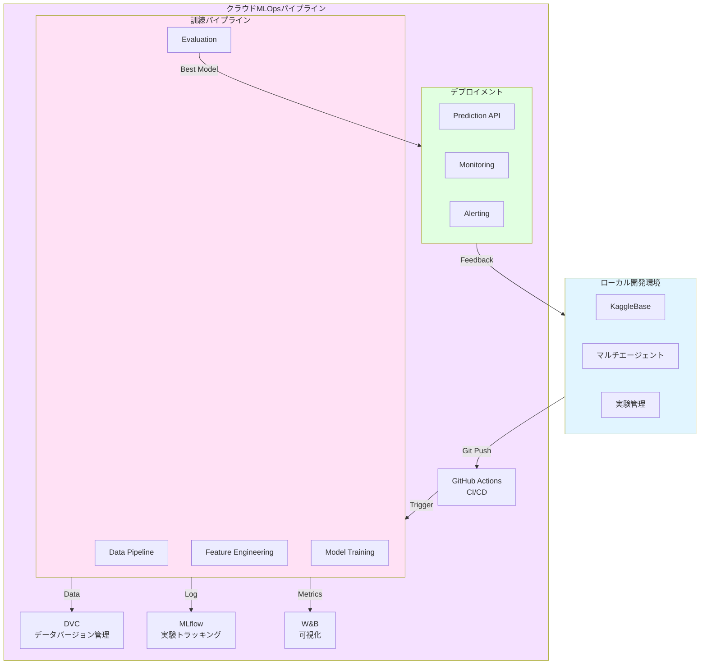

# 将来実装機能の詳細設計

このドキュメントでは、将来実装予定の機能の詳細な設計書を記載します。
実装スケジュールについては [ロードマップ](./roadmap.md) を参照してください。

## 監視スクリプトシステム（Watcher Scripts）

### 概要

監視スクリプトは、ファイルシステムの変更を自動検知し、即座に処理を実行する自動化機構です。
このシステムにより、**Markdownファイルの単一管理**を実現し、JSON形式との二重管理問題を解決します。

**現状**: 手動で `python scripts/workflow/task_converter.py` を実行することで、同等の機能を実現しています。

### 設計思想

### 問題: 従来の二重管理

```
❌ 手動変換フロー

1. 人間: Markdownでタスクを書く (knowledge/tasks/)
2. 人間: 手動でコマンド実行 (python scripts/workflow/task_converter.py)
3. JSON生成 (tasks/pending/)

課題:
- 変換し忘れによる不整合
- どちらが最新データか不明確
- 手動作業の手間
- 同期のタイムラグ
```

### 解決: Single Source of Truth

```
✅ 監視スクリプトフロー

1. 人間: Markdownでタスクを書く（これだけ！）
2. 監視スクリプト: 保存を検知（1秒以内）
3. 自動変換・更新実行

メリット:
✅ Markdownのみ管理（JSONは自動生成）
✅ 常に同期（不整合なし）
✅ 手間ゼロ（変換し忘れなし）
✅ リアルタイム更新
```

### 4つの監視スクリプト

> **注**: 以下の監視スクリプトは**未実装**です（フェーズ3で実装予定）。  
> 現状は手動で `python scripts/workflow/task_converter.py` を実行することで同等の機能を実現しています。

### 1. タスク監視（task_watcher.py）⏳ **未実装**

**役割**: タスクMarkdownの自動JSON変換

**監視対象**:
- `knowledge/inbox/`（共通Inbox: タスク候補は `type: task` 推奨）
- `knowledge/tasks/active/`
- `knowledge/tasks/waiting/`
- `knowledge/tasks/someday/`（任意：将来対象にするなら）

**自動処理**:
1. `.md` ファイルの作成・変更・削除を検知
2. YAMLフロントマターを解析
3. `tasks/current_sprint.json` に変換・更新
4. Plannerエージェントが即座に参照可能な状態に

**使用例**:
```bash
# バックグラウンドで起動
python scripts/workflow/task_watcher.py &

# Obsidianでタスク編集・保存
# → 1秒以内に自動変換完了
```

### 2. 知識ノート監視（knowledge_watcher.py）⏳ **未実装**

**役割**: Zettelkastenノートの自動インデックス化と関連性分析

**監視対象**:
- `knowledge/zettelkasten/`

**自動処理**:
1. 新規ノート作成時、自動でメタデータ抽出
2. タグ・ドメイン別にインデックス更新
3. 類似ノートを自動提案（タグベース）
4. `index.md` と `index.json` を生成

**機能**:
- **ドメイン別分類**: `#domain/feature-engineering` などで自動グループ化
- **関連ノート提案**: タグの共通性から類似ノートを提示
- **AIエージェント連携**: `index.json` をPlannerが参照

### 3. 実験コード監視（experiment_watcher.py）⏳ **未実装**

**役割**: 実験コードの品質保証（Pre-execution Validation）

**監視対象**:
- `experiments/**/*.py`

**自動検証項目**:
1. **Lintチェック**: PEP8準拠、コードスタイル
2. **構文チェック**: 実行可能な構文か
3. **config.yaml検証**: 必須フィールドの存在確認
4. **データファイル確認**: train.csv, test.csvの存在チェック

**重要**: これは**実行前の品質チェック**であり、Validatorエージェント（実行後の性能評価）とは別物

### 4. 実験結果監視（results_watcher.py）⏳ **未実装**

**役割**: 実験結果の自動知識化とフィードバックループ

**監視対象**:
- `results/**/metrics.json`

**自動処理**:
1. `metrics.json` 更新時、自動でZettelkastenノート生成
2. 実験結果のサマリー作成
3. 過学習・不安定性の自動検出
4. 改善ヒントの提示

### 統合監視システム（watch_all.py）⏳ **未実装**

**すべての監視を一括起動**

```bash
# 全監視を起動
python scripts/workflow/watch_all.py &

# 特定の監視のみ起動
python scripts/workflow/watch_all.py --only tasks,knowledge
```

### 実装の優先度（フェーズ分け）

### フェーズ3: 自動化・効率化（推奨実装時期）

監視スクリプトは、**基本ワークフローが確立した後**に導入すべきです。

**理由**:
1. フェーズ1-2で手動フローを理解
2. 課題を体感してから自動化設計
3. 過度な早期最適化を避ける

**実装順序**:
1. **task_watcher.py** （最優先: タスク管理の自動化）
2. **knowledge_watcher.py** （知識の整理効率化）
3. **results_watcher.py** （実験結果の知識化）
4. **experiment_watcher.py** （品質保証の強化）

### 技術スタック

```python
# 必須ライブラリ
watchdog>=3.0.0  # ファイルシステム監視
python-frontmatter>=1.0.0  # YAMLフロントマター解析
pyyaml>=6.0  # YAML処理
```

## MLOpsパイプライン詳細設計

### 概要

4つまでのローカル開発フローをクラウド環境に統合し、リアルタイムな運用を可能にする本格的なMLOpsパイプライン。知人のエンジニアが担当します。

### 想定される構成要素



### 統合ポイント

### 1. GitHub Actionsによる自動実験実行

詳細な設定例は実装時に追加予定。

### 2. DVCによるデータ・モデル管理

データとモデルファイルのバージョン管理をDVCで実現。

### 3. MLflowによる実験トラッキング

実験結果をMLflowに記録し、比較・分析を容易にする。

### 4. Weights & Biases (W&B) による可視化

実験の可視化とモニタリングをW&Bで実現。

### 5. 計算資源の最適割り当て

タスクの優先度と計算資源を考慮した自動スケジューリング。

### その他の将来実装機能

### Kaggle Discussion自動取り込みパイプライン

Kaggle APIを使用してディスカッションを定期的に取得し、`knowledge/references/kaggle_discussions/`に保存する機能。

### タスク優先度計算と計算資源割り当て

タスクの優先度と計算資源を考慮した実行計画の立案機能。W&B (Weights & Biases) との統合も検討。

## 関連ドキュメント

- [システム概要](./system_overview.md) - システム全体の概要と設計
- [実装ロードマップ](./roadmap.md) - 実装計画と進捗
