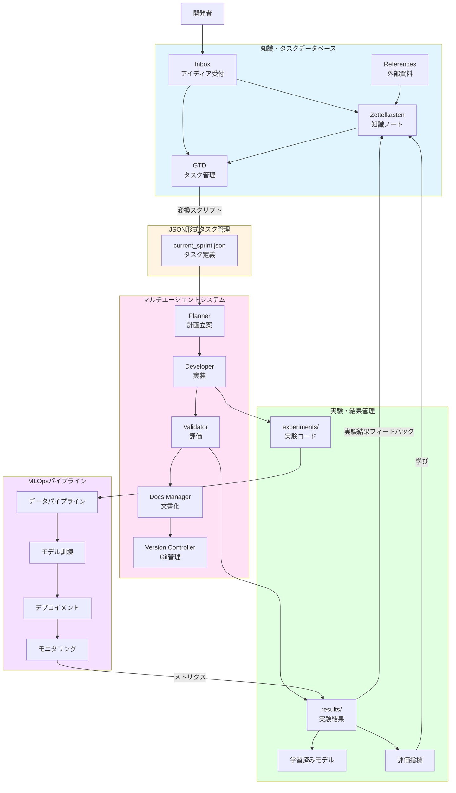
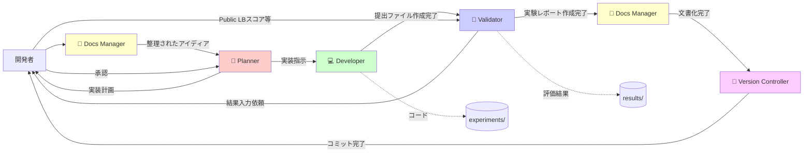
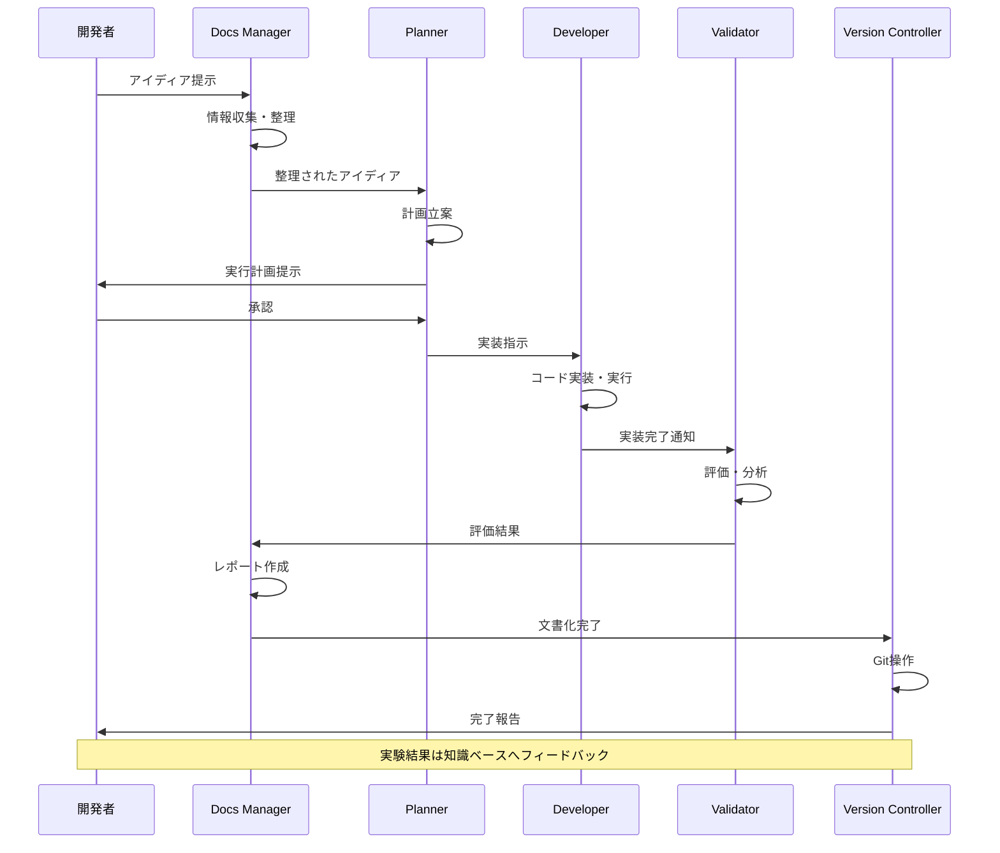
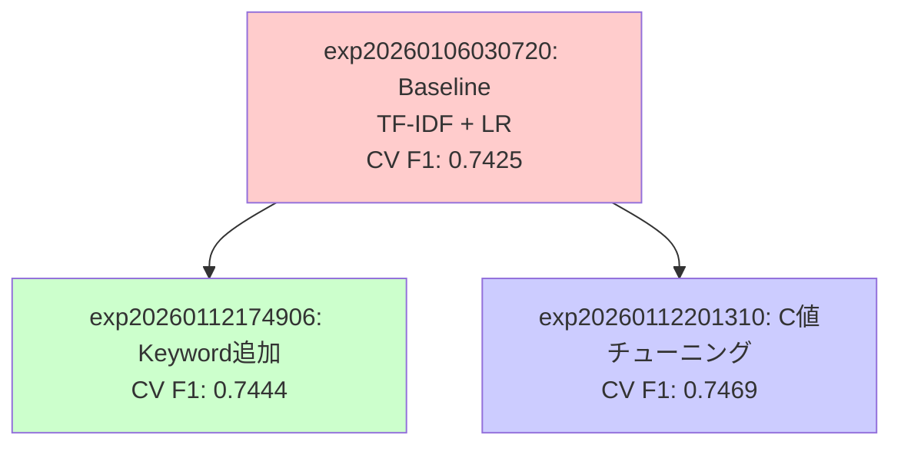
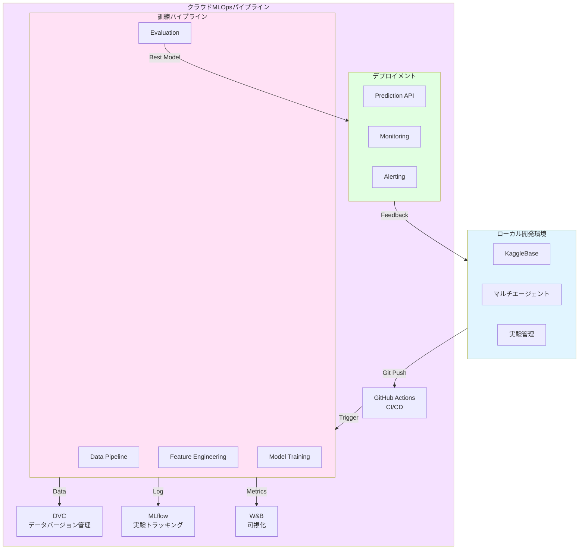
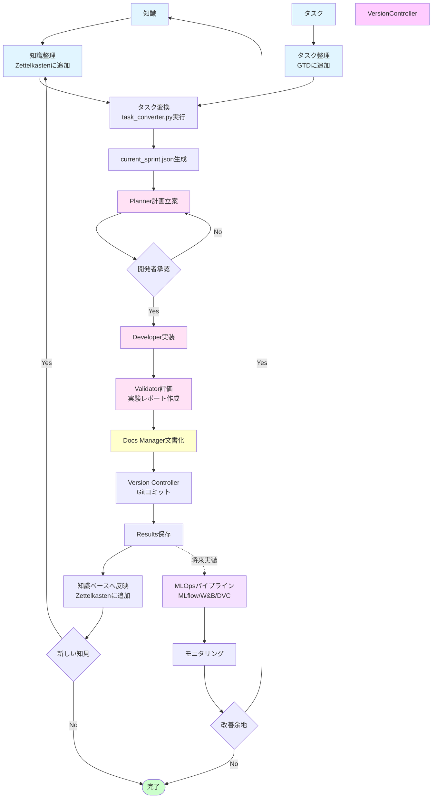

# Kaggle Competition Development Platform - アーキテクチャ設計書

> **📊 図の表示について**: このドキュメントにはMermaid図が多数含まれています。
> 図が表示されない場合は、**Markdownプレビュー**を開いてください（`Cmd+Shift+V`）。
> 詳しくは [Mermaid図の表示方法ガイド](./MERMAID_VIEWING_GUIDE.md) をご覧ください。

## エグゼクティブサマリー

本プロジェクトは、Kaggleコンペティションに参加するための統合開発プラットフォームです。知識管理（Zettelkasten + GTD）、JSON形式のタスク管理、マルチエージェントシステム、実験管理の4つの主要コンポーネントが実装済みです。MLOpsパイプラインは将来実装予定です。

### 実装状況一覧（2026年1月時点）

| コンポーネント | 実装状況 | 主要機能 |
|:---|:---|:---|
| 1. 知識・タスクデータベース | ✅ 実装済み | Obsidian、Zettelkasten、GTD |
| 2. JSON形式タスク管理 | ✅ 実装済み | task_converter.py、task_loader.py、sync_project_links.py |
| 3. マルチエージェントシステム | ✅ 実装済み | Planner、Developer、Validator、Docs Manager、Version Controller |
| 4. 実験・結果管理 | ✅ 実装済み | experiments/、results/、テンプレートシステム |
| 5. MLOpsパイプライン | ⏳ 未実装 | GitHub Actions、MLflow、W&B、DVC |
| 監視スクリプトシステム | ⏳ 未実装 | task_watcher.py、knowledge_watcher.py等 |

### プロジェクトの目的
- **知識の有機的循環**: 実験結果→知識蓄積→タスク生成→新たな実験のサイクル ✅ 実装済み
- **効率的なチーム開発**: リアルタイムな情報共有と進捗の可視化 ✅ 実装済み
- **半自動化された実験フロー**: マルチエージェントによる実験の自動実行 ✅ 実装済み
- **スケーラブルなMLOps**: 将来的な本格運用への拡張性 ⏳ 将来実装

---

## システム全体構成図

> **注**: この図はMarkdownプレビュー（`Cmd+Shift+V`または右上のプレビューアイコン）で表示されます。
> プレビューが表示されない場合は、下記のテキスト版をご参照ください。

### Mermaid図



---

## コンポーネント詳細設計

### 1. 知識・タスクデータベース (KaggleBase)

#### 概要
Obsidianを用いた知識管理システム。Zettelkasten（永続的な知識）とGTD（実行可能なタスク）を組み合わせ、有機的な知識循環を実現します。

#### 名称提案: **KaggleBase** (Kaggle Knowledge Base)
代替案: CompetitionVault, InsightHub, ML-Zettel

#### 実装済み機能

##### ディレクトリ構造

```
knowledge/
├── inbox/                      # 未整理の情報
│   ├── _inbox_guide.md        # ガイド
│   ├── YYYYMMDD_idea_*.md     # アイディアメモ
│   ├── YYYYMMDD_reference_*.md # 参考資料候補
│   ├── YYYYMMDD_task_candidate_*.md # タスク候補
│   └── archive/                # アーカイブ
│
├── zettelkasten/              # 知識ノート（永続的）
│   ├── _zettelkasten_guide.md # ガイド
│   ├── permanent/             # 永続ノート
│   │   ├── 20240101000000_feature_engineering_basics.md
│   │   └── 20240102000000_gradient_boosting_theory.md
│   ├── references/            # 外部資料（論文、書籍等）
│   │   ├── papers/            # 学術論文
│   │   └── books/             # 書籍
│   ├── structure/             # 構造・設計に関するノート
│   └── index/                 # インデックス
│
├── tasks/                     # GTDタスク管理
│   ├── _gtd_guide.md          # ガイド
│   ├── _MASTER_TASKS.md       # マスタータスクリスト
│   ├── active/                # アクティブなタスク
│   │   ├── task_YYYYMMDDHHMMSS_*.md
│   │   └── _active_guide.md
│   ├── waiting/                # 待機中
│   │   └── _waiting_guide.md
│   ├── someday/                # いつかやる
│   │   └── _someday_guide.md
│   ├── completed/              # 完了
│   │   └── _completed_guide.md
│   ├── projects/               # プロジェクト（複数タスクの集合）
│   │   ├── project_*.md
│   │   ├── archive/            # アーカイブ済みプロジェクト
│   │   └── _projects_guide.md
│   └── archive/                # アーカイブ
│       └── _archive_guide.md
│
└── templates/                 # テンプレート
    ├── inbox/
    ├── tasks/
    └── zettelkasten/
```

##### タグ規則体系

実際の実装では、**YAMLフロントマターのフィールド**と**タグ**を組み合わせて管理しています。

##### 1. タイプ管理（YAMLフロントマターの`type`フィールド）
- `type: task` - タスク（GTD）
- `type: project` - プロジェクト（複数タスクの集合）
- `type: idea` - アイディア
- `type: permanent` - 永続ノート（Zettelkasten）
- `type: reference` - 参考資料

##### 2. ステータス管理（YAMLフロントマターの`status`フィールド）
- `status: inbox` - 未整理（inbox/）
- `status: active` - アクティブ（tasks/active/）
- `status: waiting` - 待機中（tasks/waiting/）
- `status: completed` - 完了（tasks/completed/）
- `status: archived` - アーカイブ

##### 3. プロジェクト管理（YAMLフロントマターの`project`フィールド）
- `project: kaggle_disaster_tweets` - コンペ固有プロジェクト
- `project: docs_revision` - ドキュメント改訂プロジェクト
- `project: infrastructure` - インフラ整備プロジェクト

##### 4. タグ（YAMLフロントマターの`tags`フィールド）
タグは**フラットな形式**で使用されます。主なタグ例：

**コンペ・プロジェクト関連**:
- `kaggle` - Kaggle関連全般
- `kaggle_disaster_tweets` - Disaster Tweetsコンペ
- `project` - プロジェクト関連
- `docs` - ドキュメント関連

**タスク・作業関連**:
- `experiment` - 実験関連
- `improvement` - 改善関連
- `hyperparameter` - ハイパーパラメータ関連
- `baseline` - ベースライン関連

**技術・領域関連**:
- `nlp` - 自然言語処理
- `eda` - 探索的データ分析
- `logistic-regression` - モデル名
- `tfidf` - 特徴量エンジニアリング手法

**その他**:
- `gtd` - GTDシステム関連
- `reference` - 参考資料
- `report` - レポート

##### Zettelkastenノートテンプレート（permanent/）

```markdown
---
id: 20240101000000
title: Gradient Boostingの基礎理論
author: takeikumi
type: permanent
form: note  # or: report, summary
tags: [kaggle, model, gradient-boosting, xgboost]
links:
  - project_kaggle_disaster_tweets  # 関連プロジェクト
  - 20240102000000  # 関連ノートへのリンク
created: 2024-01-01
updated: 2024-01-15
---

# Gradient Boostingの基礎理論

## 内容

Gradient Boostingの基本的な考え方と数学的背景について...

## 主要な概念
1. 損失関数の勾配
2. 弱学習器の逐次追加
3. 学習率とその影響

## 実践的な知見
- XGBoost vs LightGBM vs CatBoost
- ハイパーパラメータのチューニング戦略

## 学び
実験exp20260106030720の結果から、学習率を0.1から0.05に下げることで...

## 関連ノート
- [[project_kaggle_disaster_tweets|プロジェクト: Disaster Tweets]]
- [[20240102000000|関連ノート名]]
```

##### GTDタスクテンプレート（tasks/active/）

```markdown
---
type: task
id: task-20240115120000
title: 'Disaster Tweets: ベースラインモデルの構築'
author: takeikumi
status: active
priority: high
project: kaggle_disaster_tweets
mode: experiment  # or: research, infrastructure, docs
context:
  - project_kaggle_disaster_tweets
dependencies: []
related_notes:
  - disaster_tweets_eda_20260105180000
created: 2024-01-15
updated: 2024-01-15
tags:
  - kaggle
  - kaggle_disaster_tweets
  - baseline
  - experiment
---

# タスク: Disaster Tweets - ベースラインモデルの構築

## 目的

Disaster Tweetsコンペの初期ベースラインとして、TF-IDF + LogisticRegressionモデルを構築し評価する。

## 期待される成果
- CV F1 Score > 0.70
- Public LB Score > 0.75
- 実験コードと結果が適切に保存されている

## 実行手順
1. データの読み込み（train.csv, test.csv）
2. 前処理（lowercase、URL除去、メンション除去）
3. TF-IDF特徴量エンジニアリング
4. LogisticRegressionモデルの訓練
5. 5-fold StratifiedKFold CVによる評価
6. 提出用CSV生成

## 完了条件
- [ ] 実験コードが`experiments/expYYYYMMDDHHMMSS_*/`に保存されている
- [ ] 評価結果が`results/expYYYYMMDDHHMMSS_*/`に保存されている
- [ ] 実験レポート（`expYYYYMMDDHHMMSS_report.md`）が作成されている
- [ ] Gitにコミットされている

## 実験結果（後で記入）
- 実験ID: 
- CV F1 Score: 
- Public LB: 
- 学んだこと:
```

##### プロジェクトテンプレート（tasks/projects/）

```markdown
---
type: project
id: project-[project-name]
title: [プロジェクト名]
project: [project_id]
created: YYYY-MM-DD
updated: YYYY-MM-DD
tags:
  - project
  - [関連タグ]
status: active
---

# [プロジェクト名]

## タスク一覧（Dataview）

```dataview
TABLE WITHOUT ID
  default(id, file.name) AS id,
  link(file.path, default(title, file.name)) AS task,
  status,
  priority,
  due_date,
  mode,
  updated
FROM "knowledge/tasks"
WHERE type = "task" AND project = this.project
SORT choice(status="active",0, choice(status="waiting",1, choice(status="someday",2, 3))) ASC,
  choice(priority="critical",0, choice(priority="high",1, choice(priority="medium",2, 3))) ASC,
  due_date ASC,
  updated DESC
```

## 目的 / 成果物

[プロジェクトの目的と期待される成果物]

### 背景

[プロジェクトの背景]

### 成果物

[期待される成果物のリスト]

## 状態メモ

- 開始日: YYYY-MM-DD
- 現在の実装状況:
  - [実装状況のメモ]

## 関連ノート（情報ハブ）

[関連する知識ノートへのリンク]
```

#### 将来実装予定

##### Kaggle Discussion自動取り込みパイプライン
Kaggle APIを使用してディスカッションを定期的に取得し、`knowledge/references/kaggle_discussions/`に保存する機能。

詳細は「[将来実装機能の詳細設計](#将来実装機能の詳細設計)」セクションを参照してください。

---

### 2. JSON形式タスク管理システム

#### 概要
ObsidianのGTDタスクをJSON形式に変換し、マルチエージェントシステムに引き渡す仕組み。SSOT（`knowledge/tasks/`）から `scripts/workflow/task_converter.py` で `tasks/current_sprint.json` を生成します。

#### 実装済み機能

##### タスクJSON スキーマ

```json
{
  "generated_at": "2026-01-14T01:21:11",
  "tasks": [
    {
      "id": "task-20260112173705",
      "title": "Disaster Tweets: keyword特徴量の追加実験",
      "type": "task",
      "status": "in_progress",
      "priority": "high",
      "mode": "experiment",
      "project": "kaggle_disaster_tweets_baseline_improvement",
      "assigned_agent": null,
      "assignee": null,
      "context": [
        "project_kaggle_disaster_tweets_baseline_improvement",
        "project_kaggle_disaster_tweets"
      ],
      "dependencies": [
        "exp20260106030720_report"
      ],
      "related_notes": [
        "disaster_tweets_baseline_improvement_ideas_20260112162435",
        "exp20260106030720_report"
      ],
      "source_file": "knowledge/tasks/active/task_disaster_tweets_keyword_feature_20260112173705.md",
      "tags": [
        "kaggle",
        "kaggle_disaster_tweets",
        "improvement",
        "experiment"
      ],
      "due_date": null,
      "updated_at": "2026-01-12T00:00:00"
    }
  ]
}
```

##### タスク変換スクリプト

**実装ファイル**: `scripts/workflow/task_converter.py`

**機能**:
- `knowledge/tasks/{active|waiting|someday|completed}/` 配下のMarkdownファイルを読み込み
- YAMLフロントマターからタスク情報を抽出
- `tasks/current_sprint.json` に変換・出力
- タスクは優先度・ステータス・期日・更新日時でソート

**使用方法**:
```bash
python scripts/workflow/task_converter.py
```

**出力**: `tasks/current_sprint.json`（AIエージェント向けのタスク定義ファイル）

**実装済みの主要機能**:
- Markdownパース（YAML frontmatter対応）
- ステータス変換（ディレクトリ名 → JSONステータス）
- ソート機能（優先度・ステータス・期日・更新日時）
- エラーハンドリング（パースエラーファイルのスキップ）

##### 関連スクリプト
- `scripts/workflow/task_loader.py`: タスクJSONを読み込むユーティリティ
- `scripts/workflow/sync_project_links.py`: プロジェクトとタスク間のリンクを自動同期

#### 将来実装予定

##### タスク優先度計算と計算資源割り当て
タスクの優先度と計算資源を考慮した実行計画の立案機能。W&B (Weights & Biases) との統合も検討。

詳細は「[将来実装機能の詳細設計](#将来実装機能の詳細設計)」セクションを参照してください。

---

### 3. マルチエージェントシステム

#### 概要
Cursor/VSCode内で動作する5つの専門AIエージェントが協調して実験を実行します。各エージェントは明確に定義された役割を持ち、他のエージェントの領域に侵入しません。

#### 実装済み機能

##### エージェント構成図



##### エージェント詳細仕様

##### 1. 🧠 Planner (指揮官)

**役割**: 論理的な実行計画の立案、タスク分解、専門エージェントへの委譲

**入力**:
- `tasks/current_sprint.json`からのタスクJSON
- Docs Managerからの整理されたアイディア

**処理**:
1. タスクの目的と仮説を明確化
2. 具体的な実装手順を立案
3. 期待される成果を定量化
4. リスク要因と対策を特定
5. 適切なエージェントに作業を割り当て

**出力形式**:
```
[Plan:]
- 実装の目的: TF-IDF + LogisticRegressionベースラインモデルの構築
- 仮説: シンプルなテキスト特徴量でもCV F1 > 0.70を達成できる
- 実装手順:
  1. データ読み込みと基本的なEDA (Developer担当)
  2. 前処理パイプライン構築 (Developer担当)
  3. TF-IDF特徴量エンジニアリング (Developer担当)
  4. LogisticRegressionモデル訓練と実行 (Developer)
  5. 実験レポート作成 (Validator)
- 期待される成果: CV F1 > 0.70, Public LB > 0.75
- リスク: 過学習の可能性 → Cパラメータ調整を検討

[Action:]
@Developer: experiments/expYYYYMMDDHHMMSS_baseline_tfidf_lr/を作成し、上記手順1-4を実装してください
```

**制約**:
- コード生成は禁止
- 常に`[Plan:]`と`[Action:]`の形式で出力
- 意思決定と指示出しに専念

##### 2. 💻 Developer (実装者)

**役割**: データ処理、特徴量生成、モデル訓練のPython実装と実行

**入力**:
- Plannerからの実装指示
- タスクJSONの詳細仕様

**処理**:
1. `experiments/exp[timestamp]_[description]/`ディレクトリの作成
2. Pythonコードの実装（`train.py`, `predict.py`）
3. 設定ファイルの作成（`config.yaml`）
4. コードの実行
5. 結果ファイルの生成（`results/exp[timestamp]_[description]/`）

**作成するファイル**:
- `experiments/exp[timestamp]_[description]/exp[timestamp]_config.yaml` - 実験設定
- `experiments/exp[timestamp]_[description]/exp[timestamp]_train.py` - 学習スクリプト
- `experiments/exp[timestamp]_[description]/exp[timestamp]_predict.py` - 推論スクリプト
- `results/exp[timestamp]_[description]/exp[timestamp]_metrics.json` - 評価指標
- `results/exp[timestamp]_[description]/exp[timestamp]_cv_results.json` - CV結果
- `results/exp[timestamp]_[description]/exp[timestamp]_model.pkl` - モデルファイル
- `results/exp[timestamp]_[description]/exp[timestamp]_submission.csv` - 提出ファイル

**出力形式**:
````python
# experiments/exp20260106030720_baseline_tfidf_lr/exp20260106030720_train.py
import pandas as pd
from sklearn.feature_extraction.text import TfidfVectorizer
from sklearn.linear_model import LogisticRegression
# ... (実装コード)

[Result:]
✓ 実験exp20260106030720を完了しました
- CV F1 Score: 0.7425 ± 0.0137
- Train F1: 0.8542
- 実装ファイル: experiments/exp20260106030720_baseline_tfidf_lr/
- 結果ファイル: results/exp20260106030720_baseline_tfidf_lr/
- 所要時間: 15分
- 次のステップ: @Validator に引き継ぎ、実験レポート作成を依頼
````

**制約**:
- 評価ロジックの断定は禁止（Validatorの役割）
- 実験レポート（report.md）の作成は禁止（Validatorの役割）
- 出力はコードブロックと`[Result:]`のみ
- 実装完了後、Validatorに引き継ぎ、実験レポートの作成を依頼する

##### 3. 🧪 Validator (評価者)

**役割**: Developerの実装結果を評価し、実験レポートを作成

**入力**:
- Developerが作成した実験コード（`experiments/exp[timestamp]_[description]/`）
- Developerが作成した結果ファイル（`results/exp[timestamp]_[description]/`）
  - `metrics.json` - 評価指標
  - `cv_results.json` - CV結果
  - `model.pkl` - モデルファイル
  - `submission.csv` - 提出ファイル
- **ユーザーから提供される提出後の結果**（Public LBスコア等）

**処理**:
1. Developerからの引き継ぎを受ける（提出ファイル作成完了後）
2. **ユーザーに結果入力を依頼する**: Kaggle提出後の結果（Public LBスコア等）をユーザーに入力依頼する
3. **ユーザーから結果を受け取る**
4. Developerの実装コードと結果ファイルを確認
5. モデル性能の客観的評価（CV結果、Public LBスコア等を含む）
6. 評価指標の解釈（CV結果、Public LBスコアなど）
7. 結果の考察と改善点の提示
8. 実験レポートの作成

**作成するファイル**:
- `results/exp[timestamp]_[description]/exp[timestamp]_report.md` - 実験レポート

**実験レポートの構成**:
1. **YAMLフロントマター**: メタデータ（type, experiment_id, date, project, tags, metrics等）
2. **実験概要**: 実験ID、実施日、目的、親実験、関連タスク
3. **仮説**: 実験の仮説
4. **実装内容**: 前処理、特徴量、モデル、CV方式
5. **ハイパーパラメータ**: config.yamlの内容
6. **結果**: 評価指標、CV詳細、特徴量情報
7. **学んだこと**: 結果の解釈と考察
8. **次のステップ**: 改善提案と今後の実験方針
9. **ファイル一覧**: 実験コード（experiments/）と結果ファイル（results/）の一覧

**出力形式**（knowledgeフォルダの様式に合わせる）:
```markdown
---
id: 20260106030720
title: Disaster Tweets - baseline_tfidf_lr_text_only
author: takeikumi
type: experiment_report
experiment_id: exp20260106030720
project: kaggle_disaster_tweets
form: report
description: ベースライン: textのみ + TF-IDF(1-2gram) + LogisticRegression
parent_experiment: null
related_task: task-20260105120020  # 実際のタスクID（タイムスタンプ形式）
tags: [kaggle, kaggle_disaster_tweets, baseline, tfidf, logistic-regression, nlp, experiment, report]
status: completed
metrics:
  train_f1: 0.8542
  cv_mean: 0.7425
  cv_std: 0.0137
  public_lb: 0.80079
model:
  type: LogisticRegression
  features: tfidf
links:
  - project_kaggle_disaster_tweets
  - task-20260105120020
  - disaster_tweets_eda_20260105180000
created: 2026-01-06
updated: 2026-01-06
---

# Disaster Tweets - baseline_tfidf_lr_text_only

## 実験概要
| 項目 | 値 |
|:---|:---|
| 実験ID | exp20260106030720 |
| 実施日 | 2026-01-06 |
| 目的 | ベースライン: textのみ + TF-IDF(1-2gram) + LogisticRegression |

## 結果
| Metric | Train | CV Mean | CV Std | Public LB |
|:---|:---:|:---:|:---:|:---:|
| F1 Score | 0.8542 | 0.7425 | 0.0137 | 0.80079 |

## 学んだこと
- シンプルなベースラインでCV F1=0.7425、Public LB=0.80079を達成
- Public LBがCVより高いのは興味深い結果

## 次のステップ
- [ ] keyword特徴量を追加した実験を実施
- [ ] 前処理の効果を確認するため、URL/メンション除去なしの実験を実施

## ファイル一覧
```
experiments/exp20260106030720_baseline_tfidf_lr/
├── exp20260106030720_config.yaml
├── exp20260106030720_train.py
└── exp20260106030720_predict.py

results/exp20260106030720_baseline_tfidf_lr/
├── exp20260106030720_report.md         # このファイル
├── exp20260106030720_metrics.json
├── exp20260106030720_cv_results.json
├── exp20260106030720_submission.csv
└── exp20260106030720_model.pkl
```
```

**制約**:
- 学習/推論コードの再生成は禁止（Developerの役割）
- 出力は実験レポート（Markdown）に限定
- Developerから実装完了の引き継ぎを受ける

##### 4. 📝 Docs Manager (文書化・情報収集)

**役割**: 情報収集・要約・最終レポート整備

**フェーズ1入力** (実験開始前):
- ユーザーのアイディア
- 関連ドキュメント

**フェーズ1出力**:
```markdown
[アイディア整理]
目的: Disaster Tweetsベースラインモデルの構築
背景: コンペ初期段階でシンプルなベースラインが必要
関連知識: 
- [[disaster_tweets_eda_20260105180000]] EDA結果
- [[project_kaggle_disaster_tweets]] プロジェクトノート
前回の実験: なし（初回実験）

[コンテキスト]
- データセット: Disaster Tweets (7613行, 5列)
- 評価指標: F1 Score
- 現在のベストスコア: なし
```

**フェーズ2入力** (実験完了後):
- Validatorが作成した実験レポート（`results/exp[timestamp]_[description]/exp[timestamp]_report.md`）
- Developerの実装コード

**フェーズ2出力**:
```markdown
# 知識ノート: Disaster Tweetsベースライン実験の知見

## 実験概要
- 実験ID: exp20260106030720
- 実施日: 2026-01-06
- 目的: TF-IDF + LogisticRegressionでベースラインを構築

## 主要な知見
- シンプルなベースラインでCV F1=0.7425、Public LB=0.80079を達成
- Public LBがCVより高いのは興味深い結果

## 関連知識ノート
- [[disaster_tweets_eda_20260105180000]] EDA結果
- [[disaster_tweets_baseline_improvement_ideas_20260112162435]] 改善アイデア

## 次の実験方針
1. keyword特徴量の追加（exp20260112174906）
2. LogisticRegressionのC値チューニング（exp20260112201310）

## 次のステップ
- keyword特徴量を追加した実験を実施
- ハイパーパラメータチューニングで性能向上を目指す
```

**制約**:
- Pythonコード生成は禁止
- 出力はMarkdownレポートまたは要約に限定

##### 5. 🐙 Version Controller (Git管理)

**役割**: 変更の記録、コミット/プッシュ、タグ/リリース管理

**入力**:
- 全ファイル（コード、結果、ドキュメント）

**処理**:
1. 変更ファイルの確認
2. 適切なコミットメッセージの生成
3. Gitコミットの実行
4. 必要に応じてタグ付け

**出力形式**:
```bash
# 実行すべきGitコマンド

git add experiments/exp20260106030720_baseline_tfidf_lr/
git add results/exp20260106030720_baseline_tfidf_lr/
git add knowledge/zettelkasten/permanent/disaster_tweets_baseline_improvement_ideas_20260112162435.md
git commit -m "exp(baseline): ベースラインTF-IDF+LRモデル exp20260106030720

- CV F1 Score: 0.7425 ± 0.0137
- Public LB: 0.80079
- シンプルなベースラインで良好な性能を達成
- 次のステップ: keyword特徴量追加とC値チューニング

Closes: task-20260105120020
"

# タグ付け（マイルストーン時）
git tag -a v0.1.0-exp20260106030720 -m "初回ベースライン完成"
```

**コミットメッセージ規約** (Conventional Commits準拠):

```
<type>(<scope>): <subject>

<body>

<footer>
```

**タイプ**:
- `exp(<scope>): <説明> <実験ID>`: 実験（新規実験や実験の改善）
  - スコープは実験の種類や変更内容を表す（例: `baseline`, `feature`, `hyperparameter`, `data`, `model`, `preprocessing`, `ensemble`）
  - 例: `exp(baseline): ベースラインTF-IDF+LRモデル exp20260106030720`
  - 例: `exp(feature): keyword特徴量追加 exp20260112174906`
  - 例: `exp(hyperparameter): C値グリッドサーチ exp20260112201310`
- `infra(<scope>): <説明>`: インフラ整備（MLOps、ワークフロー、スクリプト、テンプレートなど）
  - 例: `infra(mlops): MLOpsパイプラインのセットアップ`, `infra(workflow): 監視スクリプトの追加`, `infra(script): task_converterの改善`
- `fix`: バグ修正
- `refactor`: リファクタリング
- `docs`: ドキュメント
- `chore`: その他

**注意**: スコープは英語、説明（subject）は日本語で記述します。

**実験スコープの例**:
- `baseline`: ベースライン実験
- `feature`: 特徴量エンジニアリング（keyword追加、特徴量追加など）
- `hyperparameter`: ハイパーパラメータチューニング（C値、max_depthなど）
- `data`: データ変更（データソース変更、データ分割方法変更など）
- `model`: モデル変更（LR → XGBoostなど）
- `preprocessing`: 前処理変更（テキストクリーニング、欠損値処理など）
- `ensemble`: アンサンブル

**インフラスコープの例**:
- `mlops`: MLOpsパイプライン
- `workflow`: ワークフロー
- `script`: スクリプト
- `template`: テンプレート

**制約**:
- Pythonコード生成は禁止
- 出力はGitコマンドとその説明に限定

##### エージェント連携フロー



##### Git運用戦略

##### ブランチ戦略

```
main (本番ブランチ)
└── develop (開発ブランチ)
    ├── feature/exp20260106030720-baseline-tfidf-lr
    ├── feature/exp20260112174906-keyword-tfidf-lr
    └── feature/infrastructure-wandb-integration
```

**ブランチルール**:
- `main`: 提出可能な安定版のみ
- `develop`: 開発中のコード統合
- `feature/expYYYYMMDDHHMMSS-*`: 実験ごとのブランチ（実験IDに基づく）
- `feature/infrastructure-*`: インフラ整備用

##### マージ戦略

1. **実験ブランチ → develop**:
   - Pull Request作成
   - チームメイトのレビュー（任意）
   - マージ後、結果をObsidianに反映

2. **develop → main**:
   - マイルストーン達成時（例: 提出可能なモデル完成）
   - タグ付け（例: `v1.0.0-submission-001`）

##### .gitignore設定

```gitignore
# データファイル
data/raw/*.csv
data/processed/*.csv
*.pkl
*.h5
*.hdf5

# モデルファイル（大容量）
results/**/model.pkl
results/**/*.joblib

# 一時ファイル
.ipynb_checkpoints/
__pycache__/
*.pyc

# Obsidian設定（個人設定）
knowledge/.obsidian/workspace*
knowledge/.obsidian/cache

# 環境設定
.env
.venv/
venv/
```

**重要**: 実験結果の`metrics.json`や`plots/`は**Git管理対象**とする

---

### 4. 実験・結果管理 (Experiments & Results)

#### 概要
各実験は一意のIDで管理され、コード、結果、メタデータが体系的に保存されます。画像で示されたディレクトリ構造を採用します。

#### 実装済み機能

##### ディレクトリ構造（詳細版）

```
project/
├── experiments/              # 実験ごとのコード管理
│   ├── _template_experiment/  # 実験テンプレート
│   │   ├── config.yaml
│   │   └── README.md
│   │
│   ├── exp20260106030720_baseline_tfidf_lr/  # 実験ID: exp20260106030720
│   │   ├── exp20260106030720_config.yaml     # パラメータ設定
│   │   ├── exp20260106030720_train.py        # 学習コード
│   │   └── exp20260106030720_predict.py      # 推論コード
│   │
│   ├── exp20260112174906_keyword_tfidf_lr/   # 実験ID: exp20260112174906
│   │   ├── exp20260112174906_config.yaml
│   │   ├── exp20260112174906_train.py
│   │   └── exp20260112174906_predict.py
│   │
│   └── exp20260112201310_lr_c_tuning/        # 実験ID: exp20260112201310
│       ├── exp20260112201310_config.yaml
│       ├── exp20260112201310_train.py
│       └── exp20260112201310_predict.py
│
└── results/                 # 実験ごとの出力結果
    ├── exp20260106030720_baseline_tfidf_lr/  # 実験ID: exp20260106030720 の結果
    │   ├── exp20260106030720_submission.csv  # 提出用予測
    │   ├── exp20260106030720_model.pkl       # 学習済みモデル
    │   ├── exp20260106030720_metrics.json    # 評価指標
    │   ├── exp20260106030720_cv_results.json # クロスバリデーション結果
    │   └── exp20260106030720_report.md       # 実験レポート
    │
    ├── exp20260112174906_keyword_tfidf_lr/   # 実験ID: exp20260112174906 の結果
    │   ├── exp20260112174906_submission.csv
    │   ├── exp20260112174906_model.pkl
    │   ├── exp20260112174906_metrics.json
    │   ├── exp20260112174906_cv_results.json
    │   └── exp20260112174906_report.md
    │
    └── exp20260112201310_lr_c_tuning/        # 実験ID: exp20260112201310 の結果
        ├── exp20260112201310_submission.csv
        ├── exp20260112201310_model.pkl
        ├── exp20260112201310_metrics.json
        ├── exp20260112201310_cv_results.json
        ├── exp20260112201310_c_search.json   # ハイパーパラメータ探索結果
        └── exp20260112201310_report.md
```

##### 実験IDの命名規則

**基本形式**: `exp[YYYYMMDDHHMMSS]_[short-description]` (タイムスタンプ形式)

**実装例**:
- `exp20260106030720_baseline_tfidf_lr`: 初回ベースライン（TF-IDF + Logistic Regression）
- `exp20260112174906_keyword_tfidf_lr`: keyword特徴量追加版
- `exp20260112201310_lr_c_tuning`: Logistic RegressionのCパラメータチューニング

**命名規則の詳細**:
- タイムスタンプ: `YYYYMMDDHHMMSS` 形式（年4桁、月2桁、日2桁、時2桁、分2桁、秒2桁）
- 説明: アンダースコア区切りで実験の内容を簡潔に記述
- 例: `exp20260106030720_baseline_tfidf_lr` = 2026年1月6日3時7分20秒に作成されたベースライン実験（TF-IDF + LR）

**注意**: 初期設計では `exp001` 形式を想定していたが、実装ではタイムスタンプ形式を採用。これにより、実験の作成時刻がIDから判別可能になり、時系列での管理が容易になる。

##### config.yaml テンプレート

```yaml
# experiments/expYYYYMMDDHHMMSS_[description]/expYYYYMMDDHHMMSS_config.yaml

experiment:
  id: "expYYYYMMDDHHMMSS"  # タイムスタンプ形式（例: exp20260106030720）
  name: "[description]"
  description: "[詳細な説明]"
  created_at: "YYYY-MM-DDTHH:MM:SS"
  parent_experiment: null  # 派生元の実験ID（初回はnull）
  tags:
    - baseline

data:
  train_path: "data/raw/train.csv"  # リポジトリルート基準の相対パス
  test_path: "data/raw/test.csv"
  # processed_path: "data/processed/expYYYYMMDDHHMMSS/"

preprocessing:
  # NLP用
  lowercase: true
  remove_urls: true
  remove_mentions: true
  remove_hashtags: false
  remove_emojis: false
  # 汎用
  missing_value_strategy: "median"  # or: mean, mode, drop

feature_engineering:
  type: "tfidf"  # or: count, embeddings, transformers
  params:
    max_features: 10000
    ngram_range: [1, 2]
    min_df: 2

model:
  type: "LogisticRegression"  # or: LinearSVC, XGBoost, LightGBM, BERT
  params:
    C: 1.0
    max_iter: 1000
    random_state: 42

validation:
  method: "stratified_kfold"  # or: kfold, holdout
  n_folds: 5
  shuffle: true
  random_state: 42

output:
  results_dir: "./results/"
  save_model: true
  save_predictions: true
  save_plots: false

seed: 42
```

##### metrics.json テンプレート（実装例）

**用途**: 実験結果の評価指標を保存するJSONファイル。以下の目的で使用されます：

1. **実験レポート作成**: Validatorエージェントが実験レポート（`report.md`）を作成する際に参照
2. **結果の比較**: 複数の実験結果を比較して、最良モデルを特定
3. **Git管理**: 軽量な結果ファイルとしてGitにコミット（実験の再現性確保）
4. **Public LBスコアの追記**: Kaggle提出後のPublic LBスコアを手動で追記
5. **知識ベースへの反映**: 実験結果を知識ノート（Zettelkasten）に反映する際のデータソース

**実装済みの構造**: 実験の種類（分類/回帰）や目的に応じて柔軟な構造を採用。

**分類タスクの例**（Disaster Tweets）:
```json
{
  "experiment_id": "exp20260106030720",
  "train_f1": 0.8542,
  "cv_mean": 0.7425,
  "cv_std": 0.0137,
  "cv_scores": [0.7587, 0.7444, 0.7178, 0.7411, 0.7506],
  "public_lb": 0.80079
}
```

**ハイパーパラメータチューニングを含む例**:
```json
{
  "experiment_id": "exp20260112201310",
  "best_C": 5.0,
  "train_f1": 0.9408,
  "cv_mean": 0.7469,
  "cv_std": 0.0100,
  "cv_scores": [0.7516, 0.7568, 0.7282, 0.7461, 0.7516],
  "train_cv_gap": 0.1940,
  "c_search_results": [
    {
      "C": 1.0,
      "cv_mean": 0.7425,
      "cv_std": 0.0137,
      "train_f1": 0.8542,
      "train_cv_gap": 0.1117
    },
    {
      "C": 5.0,
      "cv_mean": 0.7469,
      "cv_std": 0.0100,
      "train_f1": 0.9408,
      "train_cv_gap": 0.1940
    }
  ],
  "public_lb": 0.80202
}
```

**注意**: 
- メトリクスの構造は実験の種類（分類/回帰）や目的に応じて柔軟に変更可能
- 回帰タスクの場合は `rmse`, `mae`, `r2` などを使用
- 分類タスクの場合は `f1`, `accuracy`, `precision`, `recall` などを使用
- ハイパーパラメータチューニングの結果も必要に応じて含める

##### 実験の系統樹管理（Obsidian Graph View活用）

##### 派生関係の記録方法

各実験の`config.yaml`の`parent_experiment`フィールドに親実験IDを記載。また、実験レポート（`report.md`）に親実験へのリンクを記載：

```markdown
# Experiment: exp20260112174906 - keyword特徴量追加

## 実験概要
- 実験ID: exp20260112174906
- 親実験: exp20260106030720（ベースライン）
- 実施日: 2026-01-12

## このexperimentで試したこと
- keyword特徴量の追加
- TF-IDF特徴量との組み合わせ

## 結果
CV F1: 0.7425 → 0.7444 (改善!)

## 派生先
- exp20260112201310: LogisticRegressionのC値チューニング
```

##### Obsidian Graph View での可視化



**実装方法**:
1. 各実験の`config.yaml`の`parent_experiment`フィールドに親実験IDを記載
2. 実験レポート（`report.md`）に親実験へのWikilinks形式でリンクを記述
3. Obsidianが自動的にグラフを生成
4. タグ `#best-score` で最良モデルをマーキング

##### 実験テンプレート自動生成スクリプト ⏳ **未実装**

実験テンプレートの自動生成スクリプトは現在未実装です。新規実験の作成時は、`experiments/_template_experiment/`をコピーして手動で作成します。

**将来実装予定の機能**:
- `scripts/workflow/create_experiment.py`: タイムスタンプ形式の実験IDでディレクトリとテンプレートファイルを自動生成（将来実装）
- 親実験からの`config.yaml`継承機能
- 実験ディレクトリ名の自動生成（`expYYYYMMDDHHMMSS_[description]`）

---

### 5. MLOpsパイプライン ⏳ **未実装**

#### 概要
4つまでのローカル開発フローをクラウド環境に統合し、リアルタイムな運用を可能にする本格的なMLOpsパイプライン。知人のエンジニアが担当します。

**現状**: ローカル環境での開発が中心。MLOpsパイプラインは将来の拡張として計画されています。

#### 将来実装予定

##### 想定される構成要素



##### 主要な統合ポイント
- GitHub Actionsによる自動実験実行
- DVCによるデータ・モデル管理
- MLflowによる実験トラッキング
- Weights & Biases (W&B) による可視化
- 計算資源の最適割り当て

詳細な設計書は「[将来実装機能の詳細設計](#将来実装機能の詳細設計)」セクションの「MLOpsパイプライン詳細設計」を参照してください。

---

## 統合ワークフロー（全体フロー）

### 完全な実験サイクル



### 日次ワークフロー例

#### 開発者（あなた）の1日

```markdown
## 午前: 情報収集・タスク整理
1. Kaggle Discussionを確認 → KaggleBase/inboxに要約を追加
2. inboxの内容を整理:
   - 新しい特徴量のアイディア → Zettelkasten/permanent/に追加
   - 実装すべきタスク → GTDの`tasks/active/`に追加
3. task_converter.pyを実行してcurrent_sprint.jsonを更新

## 午後: 実験実行
4. Cursorでcurrent_sprint.jsonを開く
5. @Plannerを呼び出してタスクを相談
6. Plannerの計画を承認 → @Developerが実装
7. @Validatorが評価 → 改善点を確認

## 夕方: 振り返りと計画
8. 実験結果をZettelkastenに反映
9. 新しいアイディアをinboxに追加
10. 明日のタスクをGTDで整理
11. 知人とtasks/projects/project_*.mdで進捗共有（プロジェクトノート経由）
```

#### 知人（MLOpsエンジニア）の1日

```markdown
## 午前: パイプライン監視
1. MLflowダッシュボードで昨日の実験結果を確認
2. W&Bで可視化グラフをレビュー
3. 計算資源の使用状況を確認

## 午後: インフラ改善
4. GitHub ActionsのワークフローをOptimize
5. DVCのストレージ容量を確認・調整
6. 新しい実験の自動化スクリプトを作成

## 夕方: チーム連携
7. tasks/projects/project_*.mdで進捗共有（プロジェクトノート経由）
8. 次週の実験計画について相談
9. パイプラインの改善提案をissueに記録
```

---

## ディレクトリ構造（完全版）

```
Kaggle_sandbox/
│
├── .cursor/                          # Cursor/VSCode設定
│   ├── kaggle_team.mdc              # エージェント定義
│   ├── experiment_flow_instructions.mdc # 実験フロー指示
│   └── rules.json                   # カスタムルール
│
├── .github/                          # GitHub Actions
│   └── workflows/
│       ├── run_experiment.yml       # 実験自動実行
│       ├── test.yml                 # テスト
│       └── deploy.yml               # デプロイ
│
├── knowledge/                        # KaggleBase (Obsidian vault)
│   ├── .obsidian/                   # Obsidian設定
│   │   ├── workspace.json           # ワークスペース
│   │   └── plugins/                 # プラグイン
│   │
│   ├── inbox/                       # 未整理の情報
│   │   ├── _inbox_guide.md
│   │   ├── *.md                     # アイディア、参考資料候補、タスク候補
│   │   └── archive/                 # アーカイブ
│   │
│   ├── zettelkasten/                # 知識ノート
│   │   ├── _zettelkasten_guide.md
│   │   ├── permanent/               # 永続ノート
│   │   ├── references/              # 外部資料（論文、書籍等）
│   │   ├── structure/               # 構造・設計ノート
│   │   └── index/                   # インデックス
│   │
│   ├── tasks/                       # GTDタスク管理
│   │   ├── _gtd_guide.md
│   │   ├── _MASTER_TASKS.md
│   │   ├── active/                  # アクティブなタスク
│   │   │   ├── task_YYYYMMDDHHMMSS_*.md
│   │   │   └── _active_guide.md
│   │   ├── waiting/                 # 待機中
│   │   │   └── _waiting_guide.md
│   │   ├── someday/                 # いつかやる
│   │   │   └── _someday_guide.md
│   │   ├── completed/               # 完了
│   │   │   └── _completed_guide.md
│   │   ├── projects/                # プロジェクト（複数タスクの集合）
│   │   │   ├── project_*.md
│   │   │   ├── archive/             # アーカイブ済みプロジェクト
│   │   │   └── _projects_guide.md
│   │   └── archive/                 # アーカイブ
│   │       └── _archive_guide.md
│   │
│   └── templates/                   # テンプレート
│       ├── inbox/
│       ├── tasks/
│       └── zettelkasten/
│
├── tasks/                            # JSON形式タスク管理
│   └── current_sprint.json          # 現在のスプリント（task_converter.pyで自動生成）
│
├── data/                             # データ
│   ├── raw/                         # Kaggleからの生データ
│   │   ├── train.csv
│   │   ├── test.csv
│   │   └── sample_submission.csv
│   └── processed/                   # 加工済みデータ（必要に応じて）
│
├── experiments/                      # 実験コード
│   ├── _template_experiment/        # 実験テンプレート
│   │   ├── config.yaml
│   │   └── README.md
│   │
│   ├── exp20260106030720_baseline_tfidf_lr/  # 実装例1
│   │   ├── exp20260106030720_config.yaml
│   │   ├── exp20260106030720_train.py
│   │   ├── exp20260106030720_predict.py
│   │   └── exp20260106030720_report.md
│   │
│   ├── exp20260112174906_keyword_tfidf_lr/   # 実装例2
│   │   ├── exp20260112174906_config.yaml
│   │   ├── exp20260112174906_train.py
│   │   └── exp20260112174906_predict.py
│   │
│   └── exp20260112201310_lr_c_tuning/       # 実装例3
│       ├── exp20260112201310_config.yaml
│       ├── exp20260112201310_train.py
│       └── exp20260112201310_predict.py
│
├── results/                          # 実験結果
│   ├── exp20260106030720_baseline_tfidf_lr/
│   │   ├── exp20260106030720_metrics.json
│   │   ├── exp20260106030720_cv_results.json
│   │   ├── exp20260106030720_model.pkl
│   │   ├── exp20260106030720_submission.csv
│   │   └── exp20260106030720_report.md
│   │
│   ├── exp20260112174906_keyword_tfidf_lr/
│   │   ├── exp20260112174906_metrics.json
│   │   ├── exp20260112174906_cv_results.json
│   │   ├── exp20260112174906_model.pkl
│   │   ├── exp20260112174906_submission.csv
│   │   └── exp20260112174906_report.md
│   │
│   └── exp20260112201310_lr_c_tuning/
│       ├── exp20260112201310_metrics.json
│       ├── exp20260112201310_cv_results.json
│       ├── exp20260112201310_c_search.json
│       ├── exp20260112201310_model.pkl
│       ├── exp20260112201310_submission.csv
│       └── exp20260112201310_report.md
│
├── scripts/                          # スクリプト
│   ├── workflow/                    # ワークフロー管理用（実装済み）
│   └── kaggle/                      # Kaggle提出用
│   ├── task_converter.py            # Markdown→JSON変換 ✅
│   ├── task_loader.py               # タスク読み込み ✅
│   └── sync_project_links.py        # プロジェクトリンク同期 ✅
│
│   # 以下は将来実装予定
│   # ├── create_experiment.py       # 実験テンプレート生成（未実装）
│   # ├── log_to_mlflow.py           # MLflowロギング（未実装）
│   # └── mlops/                     # MLOps関連（未実装）
│
├── docs/                             # ドキュメント
│   ├── project_architecture.md      # 本ドキュメント
│   ├── workflow_guide.md            # ワークフローガイド ✅
│   └── scripts_guide.md             # スクリプトガイド ✅
│
├── scripts/                          # スクリプト
│   ├── workflow/                    # ワークフロー管理用
│   └── kaggle/                      # Kaggle提出用
│   ├── check_kaggle_auth.sh         # Kaggle認証確認
│   ├── submit_to_kaggle.sh          # Kaggle提出
│   └── submit_with_token.sh         # トークン付き提出
│
├── mcp_setup/                        # MCP設定（将来実装）
│
├── .gitignore                        # Git除外設定
├── .dvc/                             # DVCConfiguration
├── requirements.txt                  # Python依存関係
├── pyproject.toml                    # Pythonプロジェクト設定
└── README.md                         # プロジェクトREADME
```

---

## 将来実装機能の詳細設計

このセクションでは、将来実装予定の機能の詳細な設計書を記載します。

### 監視スクリプトシステム（Watcher Scripts）

> **注**: このセクションは将来実装予定の機能についての設計書です。  
> 現状は手動フロー（`python scripts/workflow/task_converter.py`）で十分に機能しています。

#### 概要

監視スクリプトは、ファイルシステムの変更を自動検知し、即座に処理を実行する自動化機構です（**将来実装予定**）。このシステムにより、**Markdownファイルの単一管理**を実現し、JSON形式との二重管理問題を解決します。

**現状**: 手動で `python scripts/workflow/task_converter.py` を実行することで、同等の機能を実現しています。

#### 設計思想

##### 問題: 従来の二重管理

```
❌ 手動変換フロー

1. 人間: Markdownでタスクを書く (knowledge/tasks/)
2. 人間: 手動でコマンド実行 (python scripts/workflow/task_converter.py)
3. JSON生成 (tasks/pending/)

課題:
- 変換し忘れによる不整合
- どちらが最新データか不明確
- 手動作業の手間
- 同期のタイムラグ
```

##### 解決: Single Source of Truth

```
✅ 監視スクリプトフロー

1. 人間: Markdownでタスクを書く（これだけ！）
2. 監視スクリプト: 保存を検知（1秒以内）
3. 自動変換・更新実行

メリット:
✅ Markdownのみ管理（JSONは自動生成）
✅ 常に同期（不整合なし）
✅ 手間ゼロ（変換し忘れなし）
✅ リアルタイム更新
```

#### 4つの監視スクリプト

> **注**: 以下の監視スクリプトは**未実装**です（フェーズ3で実装予定）。  
> 現状は手動で `python scripts/workflow/task_converter.py` を実行することで同等の機能を実現しています。

##### 1. タスク監視（task_watcher.py）⏳ **未実装**

**役割**: タスクMarkdownの自動JSON変換

**監視対象**:
- `knowledge/inbox/`（共通Inbox: タスク候補は `type: task` 推奨）
- `knowledge/tasks/active/`
- `knowledge/tasks/waiting/`
- `knowledge/tasks/someday/`（任意：将来対象にするなら）

**自動処理**:
1. `.md` ファイルの作成・変更・削除を検知
2. YAMLフロントマターを解析
3. `tasks/current_sprint.json` に変換・更新
4. Plannerエージェントが即座に参照可能な状態に

**出力形式**:
```json
{
  "generated_at": "2026-01-14T01:21:11",
  "tasks": [
    {
      "id": "task-20260112173705",
      "title": "Disaster Tweets: keyword特徴量の追加実験",
      "status": "in_progress",
      "priority": "high",
      "source_file": "knowledge/tasks/active/task_disaster_tweets_keyword_feature_20260112173705.md"
    }
  ]
}
```

**使用例**:
```bash
# バックグラウンドで起動
python scripts/workflow/task_watcher.py &

# Obsidianでタスク編集・保存
# → 1秒以内に自動変換完了
```

##### 2. 知識ノート監視（knowledge_watcher.py）⏳ **未実装**

**役割**: Zettelkastenノートの自動インデックス化と関連性分析

**監視対象**:
- `knowledge/zettelkasten/`

**自動処理**:
1. 新規ノート作成時、自動でメタデータ抽出
2. タグ・ドメイン別にインデックス更新
3. 類似ノートを自動提案（タグベース）
4. `index.md` と `index.json` を生成

**機能**:
- **ドメイン別分類**: `#domain/feature-engineering` などで自動グループ化
- **関連ノート提案**: タグの共通性から類似ノートを提示
- **AIエージェント連携**: `index.json` をPlannerが参照

##### 3. 実験コード監視（experiment_watcher.py）⏳ **未実装**

**役割**: 実験コードの品質保証（Pre-execution Validation）

**監視対象**:
- `experiments/**/*.py`

**自動検証項目**:
1. **Lintチェック**: PEP8準拠、コードスタイル
2. **構文チェック**: 実行可能な構文か
3. **config.yaml検証**: 必須フィールドの存在確認
4. **データファイル確認**: train.csv, test.csvの存在チェック

**重要**: これは**実行前の品質チェック**であり、Validatorエージェント（実行後の性能評価）とは別物

##### 4. 実験結果監視（results_watcher.py）⏳ **未実装**

**役割**: 実験結果の自動知識化とフィードバックループ

**監視対象**:
- `results/**/metrics.json`

**自動処理**:
1. `metrics.json` 更新時、自動でZettelkastenノート生成
2. 実験結果のサマリー作成
3. 過学習・不安定性の自動検出
4. 改善ヒントの提示

#### 統合監視システム（watch_all.py）⏳ **未実装**

**すべての監視を一括起動**

```bash
# 全監視を起動
python scripts/workflow/watch_all.py &

# 特定の監視のみ起動
python scripts/workflow/watch_all.py --only tasks,knowledge
```

#### 実装の優先度（フェーズ分け）

##### フェーズ3: 自動化・効率化（推奨実装時期）

監視スクリプトは、**基本ワークフローが確立した後**に導入すべきです。

**理由**:
1. フェーズ1-2で手動フローを理解
2. 課題を体感してから自動化設計
3. 過度な早期最適化を避ける

**実装順序**:
1. **task_watcher.py** （最優先: タスク管理の自動化）
2. **knowledge_watcher.py** （知識の整理効率化）
3. **results_watcher.py** （実験結果の知識化）
4. **experiment_watcher.py** （品質保証の強化）

#### 技術スタック

```python
# 必須ライブラリ
watchdog>=3.0.0  # ファイルシステム監視
python-frontmatter>=1.0.0  # YAMLフロントマター解析
pyyaml>=6.0  # YAML処理
```

### MLOpsパイプライン詳細設計

#### 概要

4つまでのローカル開発フローをクラウド環境に統合し、リアルタイムな運用を可能にする本格的なMLOpsパイプライン。知人のエンジニアが担当します。

#### 想定される構成要素


#### 統合ポイント

##### 1. GitHub Actionsによる自動実験実行

```yaml
# .github/workflows/run_experiment.yml
name: Run Experiment

on:
  push:
    branches:
      - 'feature/exp*'
  workflow_dispatch:
    inputs:
      experiment_id:
        description: '実験ID (例: exp001)'
        required: true

jobs:
  experiment:
    runs-on: ubuntu-latest
    steps:
      - uses: actions/checkout@v3
      
      - name: Set up Python
        uses: actions/setup-python@v4
        with:
          python-version: '3.10'
      
      - name: Install dependencies
        run: pip install -r requirements.txt
      
      - name: Download data with DVC
        run: dvc pull
      
      - name: Run experiment
        run: |
          cd experiments/${{ github.event.inputs.experiment_id }}
          python train.py
      
      - name: Upload results
        run: dvc add results/${{ github.event.inputs.experiment_id }}
      
      - name: Log to MLflow
        env:
          MLFLOW_TRACKING_URI: ${{ secrets.MLFLOW_URI }}
        run: python scripts/workflow/log_to_mlflow.py --exp_id ${{ github.event.inputs.experiment_id }}
```

##### 2. DVCによるデータ・モデル管理

```yaml
# .dvc/config
[core]
    remote = storage

['remote "storage"']
    url = s3://kaggle-experiments/house-prices
    
['remote "local"']
    url = /tmp/dvc-cache
```

**使用例**:
```bash
# データをバージョン管理
dvc add data/raw/train.csv
dvc add results/exp001/model.pkl

# リモートにプッシュ
dvc push

# チームメイトが最新データを取得
dvc pull
```

##### 3. MLflowによる実験トラッキング

```python
# scripts/workflow/log_to_mlflow.py
"""
実験結果をMLflowに記録するスクリプト
"""

import mlflow
import json
import yaml
from pathlib import Path

def log_experiment_to_mlflow(exp_id):
    """実験結果をMLflowにログ"""
    
    # メトリクス読み込み
    metrics_path = Path(f"results/{exp_id}/metrics.json")
    with open(metrics_path, 'r') as f:
        metrics = json.load(f)
    
    # 設定読み込み
    config_path = Path(f"experiments/{exp_id}/config.yaml")
    with open(config_path, 'r') as f:
        config = yaml.safe_load(f)
    
    # MLflowに記録
    with mlflow.start_run(run_name=exp_id):
        # パラメータ
        mlflow.log_params(config['model']['parameters'])
        
        # メトリクス
        mlflow.log_metrics({
            'rmse': metrics['metrics']['validation']['rmse'],
            'cv_mean': metrics['metrics']['validation']['cv_mean'],
            'cv_std': metrics['metrics']['validation']['cv_std']
        })
        
        # アーティファクト
        mlflow.log_artifact(f"results/{exp_id}/model.pkl")
        mlflow.log_artifact(f"results/{exp_id}/metrics.json")
        
        # タグ
        mlflow.set_tags({
            'experiment_id': exp_id,
            'parent': config['experiment'].get('parent_experiment', 'null')
        })

if __name__ == "__main__":
    import argparse
    parser = argparse.ArgumentParser()
    parser.add_argument('--exp_id', required=True)
    args = parser.parse_args()
    
    log_experiment_to_mlflow(args.exp_id)
```

##### 4. Weights & Biases (W&B) による可視化

```python
# experiments/exp001/train.py に追加
import wandb

# W&B初期化
wandb.init(
    project="kaggle-house-prices",
    name=f"exp001",
    config=config['model']['parameters']
)

# 訓練ループでログ
for epoch in range(n_epochs):
    # ... 訓練処理
    wandb.log({
        'epoch': epoch,
        'train_rmse': train_rmse,
        'val_rmse': val_rmse
    })

# 最終結果
wandb.log({
    'final_rmse': final_rmse,
    'cv_mean': cv_mean,
    'cv_std': cv_std
})

wandb.finish()
```

##### 5. 計算資源の最適割り当て

タスクの優先度と計算資源を考慮した自動スケジューリング：

```python
# scripts/workflow/mlops/resource_scheduler.py
"""
クラウド計算資源の最適割り当てスケジューラ
"""

class ResourceScheduler:
    def __init__(self, available_gpus, available_cpus):
        self.gpus = available_gpus
        self.cpus = available_cpus
    
    def schedule_experiments(self, task_queue):
        """
        優先度と計算資源要件に基づいて実験をスケジューリング
        
        Args:
            task_queue: TaskSchedulerからのタスクリスト
        
        Returns:
            実行計画（どの実験をどのリソースで実行するか）
        """
        schedule = []
        
        # 優先度順にソート
        sorted_tasks = sorted(
            task_queue, 
            key=lambda x: x['priority_score'], 
            reverse=True
        )
        
        gpu_queue = []
        cpu_queue = []
        
        for task in sorted_tasks:
            if task['computational_resources']['gpu_required']:
                gpu_queue.append(task)
            else:
                cpu_queue.append(task)
        
        # GPU実験を優先的に割り当て
        for i, task in enumerate(gpu_queue):
            if i < self.gpus:
                schedule.append({
                    'task_id': task['id'],
                    'resource': f'gpu-{i}',
                    'estimated_start': 'immediate'
                })
            else:
                schedule.append({
                    'task_id': task['id'],
                    'resource': 'gpu-queue',
                    'estimated_start': 'waiting'
                })
        
        return schedule
```

#### インターフェース設計

ローカル開発環境とMLOpsパイプラインの連携インターフェース：

```python
# scripts/workflow/mlops/pipeline_interface.py
"""
ローカル環境とMLOpsパイプラインのインターフェース
"""

class PipelineInterface:
    """ローカル実験結果をMLOpsパイプラインに送信"""
    
    def __init__(self, mlflow_uri, wandb_project):
        self.mlflow_uri = mlflow_uri
        self.wandb_project = wandb_project
    
    def push_experiment(self, exp_id):
        """実験をパイプラインにプッシュ"""
        # 1. メトリクスをMLflowに送信
        self.log_to_mlflow(exp_id)
        
        # 2. データをDVCで管理
        self.version_with_dvc(exp_id)
        
        # 3. W&Bに可視化データ送信
        self.log_to_wandb(exp_id)
    
    def pull_best_model(self, metric='rmse'):
        """最良モデルをパイプラインから取得"""
        # MLflowから最良モデルを検索
        pass
    
    def get_pipeline_status(self):
        """パイプラインの実行状況を取得"""
        pass
```

### その他の将来実装機能

#### Kaggle Discussion自動取り込みパイプライン

```python
# scripts/sync_kaggle_discussions.py
"""
Kaggle APIを使用してディスカッションを定期的に取得し、
knowledge/references/kaggle_discussions/に保存するスクリプト
"""

import kaggle
from datetime import datetime

def fetch_competition_discussions(competition_name):
    """コンペのディスカッションを取得"""
    # Kaggle API経由でディスカッション取得
    pass

def convert_to_markdown(discussion):
    """ディスカッションをMarkdown形式に変換"""
    # Zettelkastenフォーマットで保存
    pass

def update_knowledge_base():
    """新規ディスカッションを知識ベースに追加"""
    pass
```

#### タスク優先度計算と計算資源割り当て

```python
# scripts/workflow/task_scheduler.py
"""
タスクの優先度と計算資源を考慮した実行計画の立案
W&B (Weights & Biases) との統合も検討
"""

import json
from datetime import datetime, timedelta

class TaskScheduler:
    def __init__(self, tasks_json_path, available_resources):
        self.tasks = self.load_tasks(tasks_json_path)
        self.resources = available_resources
    
    def calculate_priority_score(self, task):
        """優先度スコアの計算"""
        # 期日までの日数
        days_until_due = (task['end_date'] - datetime.now()).days
        
        # 依存関係の深さ
        dependency_depth = self.get_dependency_depth(task)
        
        # 優先度マッピング
        priority_map = {'critical': 100, 'high': 75, 'medium': 50, 'low': 25}
        priority_score = priority_map.get(task['priority'], 50)
        
        # 総合スコア
        score = priority_score - (days_until_due * 2) + (dependency_depth * 10)
        return score
    
    def optimize_execution_plan(self):
        """計算資源を考慮した最適な実行計画を立案"""
        # タスクを優先度順にソート
        sorted_tasks = sorted(
            self.tasks, 
            key=self.calculate_priority_score, 
            reverse=True
        )
        
        # 計算資源の制約を考慮してスケジューリング
        schedule = []
        current_time = datetime.now()
        
        for task in sorted_tasks:
            if self.can_schedule(task, current_time):
                schedule.append({
                    'task_id': task['id'],
                    'start_time': current_time,
                    'estimated_duration': task['computational_resources']['estimated_time_minutes']
                })
                current_time += timedelta(
                    minutes=task['computational_resources']['estimated_time_minutes']
                )
        
        return schedule
    
    def integrate_with_wandb(self, schedule):
        """W&Bとの統合（実験トラッキング）"""
        import wandb
        
        wandb.init(project="kaggle-task-scheduling")
        
        for item in schedule:
            wandb.log({
                "task_id": item['task_id'],
                "scheduled_start": item['start_time'].isoformat(),
                "estimated_duration": item['estimated_duration']
            })
```

---

## 実装ロードマップ

### フェーズ1: 基盤構築（1-2週間）✅ **完了**

#### 完了済み
- [x] 基本的なディレクトリ構造作成
- [x] マルチエージェントシステム定義（kaggle_team.mdc）
- [x] 実験フロー定義（experiment_flow_instructions.mdc）
- [x] README.mdの作成
- [x] KaggleBaseのObsidian vault初期化
  - [x] Zettelkastenテンプレート作成
  - [x] GTDテンプレート作成
  - [x] タグ規則の適用
- [x] task_converter.pyの実装 ✅
- [x] task_loader.pyの実装 ✅
- [x] sync_project_links.pyの実装 ✅

### フェーズ2: ワークフロー検証（2-3週間）✅ **進行中**

- [x] 初回実験（exp20260106030720_baseline_tfidf_lr）でワークフロー全体を検証
  - [x] KaggleBaseでタスク作成
  - [x] JSON変換
  - [x] マルチエージェントでの実験実行
  - [x] 結果の知識ベースへのフィードバック
- [x] 複数の実験サイクルを回して課題抽出（exp20260106030720_baseline_tfidf_lr, exp20260112174906_keyword_tfidf_lr, exp20260112201310_lr_c_tuning）
- [x] ワークフローの改善
- [ ] ドキュメント改訂（実装内容に合わせた更新）← **現在進行中**

### フェーズ3: 自動化・効率化（3-4週間）⏳ **将来実装**

> **注**: フェーズ2でワークフローが安定した後、必要に応じて導入を検討。

- [ ] **監視スクリプトシステムの導入** 🆕
  - [ ] task_watcher.py（タスク自動変換）
  - [ ] knowledge_watcher.py（知識インデックス化）
  - [ ] results_watcher.py（結果自動知識化）
  - [ ] experiment_watcher.py（コード品質検証）
  - [ ] watch_all.py（統合監視システム）
- [ ] Kaggle Discussion自動取り込みパイプライン
  - [ ] Kaggle API連携
  - [ ] 定期実行スクリプト
- [ ] タスク優先度計算機能
- [ ] 計算資源スケジューリング（基本版）

**現状**: 手動フロー（`python scripts/workflow/task_converter.py`）で十分に機能しているため、監視スクリプトの優先度は低い。

### フェーズ4: MLOps統合（知人と協力）⏳ **将来実装**

> **注**: ローカル開発環境でのワークフローが確立した後、必要に応じて検討。

- [ ] GitHub Actions設定
- [ ] DVC導入
- [ ] MLflow連携
- [ ] W&B連携
- [ ] 計算資源の最適割り当て（クラウド版）

**現状**: ローカル環境での開発が中心。MLOpsパイプラインは将来の拡張として計画。

### フェーズ5: 高度な機能（将来）

- [ ] Obsidian Graph Viewでの実験系統樹可視化の自動化
- [ ] アンサンブルモデルの自動生成
- [ ] ハイパーパラメータ最適化の自動化
- [ ] リアルタイムダッシュボード
- [ ] チーム間の非同期コミュニケーション強化

---

## 設計上の重要な決定事項

### 1. 知識ベース名称: **KaggleBase**
- 理由: シンプルで目的が明確。「Kaggle」と「Knowledge Base」を組み合わせた造語
- 代替案も検討可: CompetitionVault, InsightHub, ML-Zettel

### 2. タグ体系: YAMLフロントマター + フラットなタグ
- 実際の実装では、YAMLフロントマターのフィールド（`type`, `status`, `project`）とフラットなタグ（`tags`フィールド）を組み合わせて管理
- タグは階層構造ではなく、フラットな形式（例: `kaggle`, `nlp`, `experiment`）

### 3. 実験ID: タイムスタンプ形式（実装済み）
- **実装形式**: `exp[YYYYMMDDHHMMSS]_[description]`（例: `exp20260106030720_baseline_tfidf_lr`）
- **理由**: 実験の作成時刻がIDから判別可能で、時系列管理が容易
- **初期設計**: `exp001` 形式を想定していたが、実装ではタイムスタンプ形式を採用

### 4. ディレクトリ分離: experiments/ と results/
- experiments/: コード（Git管理対象）
- results/: 出力（一部Git管理、大容量ファイルはDVC）

### 5. エージェント間の厳密な役割分離
- 各エージェントは自分の専門領域にのみ集中
- 他エージェントの領域に侵入しない = 責任の明確化

### 6. 監視スクリプトによる自動化戦略 🆕
- Markdownファイルを単一の真実の源（Single Source of Truth）とする
- JSON形式は自動生成される派生データとして扱う
- 人間は戦略とコンテンツに集中、ファイル同期は自動化
- フェーズ3（基本ワークフロー確立後）に導入

---

## よくある質問（FAQ）

### Q1: なぜObsidianを使うのか？
**A**: Zettelkastenとの親和性が高く、Wikilinks、Graph View、タグシステムが充実しているため。Markdown形式でGit管理も容易。

### Q2: current_sprint.jsonとGTDタスクの関係は？
**A**: GTDタスク（Markdown）がSSOTで人間向け、current_sprint.jsonがAIエージェント向けの生成物。`src/task_converter.py` で生成します。

### Q3: 実験の派生関係はどう管理する？
**A**: 各実験のREADME.mdに`parent`フィールドを記載。Obsidianが自動的にGraph Viewで可視化。

### Q4: MLOpsパイプラインとの統合タイミングは？
**A**: フェーズ2でローカルワークフローが安定してから。知人との協議で調整。

### Q5: 複数のコンペを同時に進める場合は？
**A**: YAMLフロントマターの`project`フィールド（例: `project: kaggle_disaster_tweets`）で区別。`task_converter.py`が自動的に`current_sprint.json`に集約する。

### Q6: 監視スクリプトは必須？ 🆕
**A**: いいえ、オプションです。手動フローでも問題なく動作します。ただし、導入することで以下のメリットがあります:
- Markdownのみ管理すればよい（JSON管理不要）
- 変換し忘れによる不整合を防止
- 保存と同時に自動変換（リアルタイム同期）

推奨: まず手動フローで2-3回の実験を回し、ワークフローを理解した後に導入。

### Q7: 監視スクリプトとValidatorエージェントの違いは？ 🆕
**A**: 
- **監視スクリプト**: 実行**前**のコード品質チェック（構文、Lint、ファイル存在）
- **Validatorエージェント**: 実行**後**のモデル性能評価（RMSE、CV Score）

全く異なる役割で、両方とも重要です。

---

## チーム間コミュニケーション設計

### 非同期コミュニケーションの仕組み

#### knowledge/projects/team_communication.md

```markdown
# チーム間コミュニケーション

## 今週の進捗（2024年1月第3週）

### あなた（ML担当）
- ✅ exp001: XGBoostベースライン完成 (RMSE: 0.142)
- 🔄 exp002: ターゲットエンコーディング実装中
- 📋 次: exp003でアンサンブル予定

### 知人（MLOps担当）
- ✅ GitHub Actions設定完了
- ✅ MLflow環境構築完了
- 🔄 DVC統合作業中

## 課題・相談事項

### [2024-01-15] あなた→知人
**Q**: W&B連携の優先度は？実験数が増えてきたので可視化を強化したい。
**Status**: 待機中

### [2024-01-16] 知人→あなた
**A**: 今週末にW&B統合します。それまではMLflowのUIで確認してください。
**Status**: 解決

## 今後のマイルストーン

- [ ] 2024-01-20: 初回提出（ベースラインモデル）
- [ ] 2024-01-27: アンサンブルモデル完成
- [ ] 2024-02-03: MLOpsパイプライン全面稼働
- [ ] 2024-02-10: 最終提出
```

### リアルタイム性の実現

1. **Obsidian Sync** (有料プラン): 
   - KaggleBaseをクラウド同期
   - 両者が同時に編集可能

2. **Git + Obsidian Git Plugin**:
   - 定期的に自動コミット・プッシュ
   - 知人が実験結果をリアルタイムで確認可能

3. **GitHub Discussions**:
   - 重要な意思決定はissue/discussionで記録
   - KaggleBaseからリンク

---

## 次のステップ

### すぐに取り組むべきこと

1. **KaggleBaseの初期化**
   ```bash
   # Obsidianで knowledge/ ディレクトリを開く
   # テンプレートファイルは knowledge/templates/ に配置済み
   ```

2. **task_converter.pyの動作確認**
   - 実装済み ✅
   - `python scripts/workflow/task_converter.py` で動作確認

3. **初回実験の実施**
   - `experiments/_template_experiment/`をコピーして実験ディレクトリを作成
   - ワークフロー全体を検証
   - 課題を洗い出す

### このドキュメントの改訂計画

```markdown
# 改訂履歴

## v1.0 (2024-01-XX) - 初版
- 全体構想の文書化
- 5つのコンポーネント設計
- マルチエージェントシステム詳細化

## v1.1 (2026-01-13) - 実装内容への反映
- 実装済み機能と未実装機能の明確な分離
- 実装済みの実験（exp20260106030720, exp20260112174906, exp20260112201310）の反映
- 実際のディレクトリ構造への更新
- タスクJSONスキーマの実装形式への更新
- config.yamlテンプレートの実装形式への更新

## v2.0 (予定) - MLOps統合版
- MLOpsパイプライン統合後の更新
- クラウド環境での運用ノウハウ追加
- スケーリング戦略の追記
```

---

## まとめ

本プロジェクトは、**KaggleBase（知識・タスク管理）**、**JSON形式タスク管理**、**マルチエージェントシステム**、**実験・結果管理**、**MLOpsパイプライン**の5つのコンポーネントから構成される統合開発プラットフォームです。

### 核心的な価値

1. **有機的な知識循環**: 実験→知識→タスク→実験の好循環
2. **効率的なチーム開発**: リアルタイムな情報共有と進捗可視化
3. **半自動化された実験フロー**: マルチエージェントによる実装自動化
4. **スケーラブルな設計**: ローカル→クラウドへのスムーズな移行

### 成功の鍵

- **役割の明確な分離**: 各エージェント、各コンポーネントが責任を持つ範囲を明確化
- **段階的な実装**: フェーズごとに検証しながら進める
- **柔軟な改善**: 実験結果を基にワークフローを継続的に改善

このアーキテクチャは、Kaggleコンペに限らず、他のML/AIプロジェクトにも応用可能な汎用的な設計となっています。

---

**最終更新**: 2026-01-14  
**バージョン**: v1.2  
**作成者**: チーム  
**レビュー**: 定期的に実験結果を反映して更新

## 改訂履歴

### v1.2 (2026-01-14)
- **実装内容に合わせた全面改訂**
  - タスクJSONスキーマを実際の実装に合わせて更新
  - 実験ID・タスクIDの命名規則をタイムスタンプ形式に統一
  - config.yamlテンプレートを実際の構造に合わせて更新
  - ディレクトリ構造を実際の実装に合わせて修正
  - 実装済み機能と未実装機能を明確に分離
  - 将来実装機能の詳細設計セクションを新設
- **構造の改善**
  - 各コンポーネントを実装済み/未実装で明確に分離
  - 実装状況一覧表を追加
  - 可読性と保守性の向上

### v1.1 (2026-01-13)
- **監視スクリプトシステム**の章を追加
- 4つの監視スクリプト（task, knowledge, experiment, results）の詳細設計
- Single Source of Truth による二重管理問題の解決方法
- エージェントとの連携フロー図
- FAQ に監視スクリプト関連の質問を追加
- 実装ロードマップを更新（フェーズ3に監視スクリプト追加）

### v1.0 (2024-11-30)
- 初版リリース
- 5つのコンポーネント設計（知識管理、タスク管理、マルチエージェント、実験管理、MLOps）
- マルチエージェントシステムの詳細化
- 実験管理ディレクトリ構造
- 実装ロードマップ