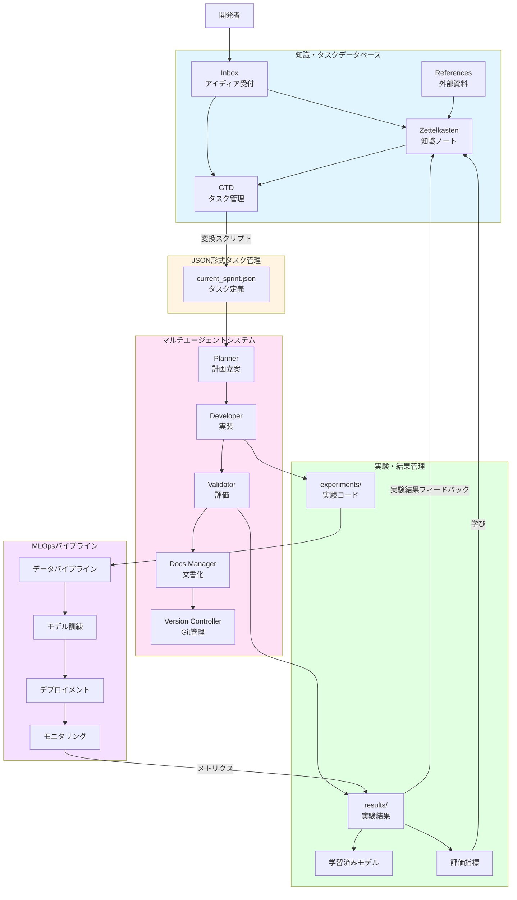

# システム概要

## エグゼクティブサマリー

本プロジェクトは、Kaggleコンペティションに参加するための統合開発プラットフォームです。
知識管理（Zettelkasten + GTD）、JSON形式のタスク管理、マルチエージェントシステム、実験管理の4つの主要コンポーネントが実装済みです。
MLOpsパイプラインは将来実装予定です。

### プロジェクトの目的

- **知識の有機的循環**: 実験結果→知識蓄積→タスク生成→新たな実験のサイクル ✅ 実装済み
- **効率的なチーム開発**: リアルタイムな情報共有と進捗の可視化 ✅ 実装済み
- **半自動化された実験フロー**: マルチエージェントによる実験の自動実行 ✅ 実装済み
- **スケーラブルなMLOps**: 将来的な本格運用への拡張性 ⏳ 将来実装

## システム全体構成図

VSCode で閲覧するには Markdown Preview Mermaid Support 拡張機能をインストールしてください。

## 関連ドキュメント

詳細な設計については、以下のドキュメントを参照してください：

- [プロジェクトアーキテクチャ](./project_architecture.md) - システム設計の概要と各コンポーネントへのリンク
- [コンポーネント詳細設計](./components/) - 各コンポーネントの詳細
  - [知識・タスクデータベース](./components/knowledge_database.md)
  - [JSON形式タスク管理システム](./components/task_management.md)
  - [マルチエージェントシステム](./components/multi_agent_system.md)
  - [実験・結果管理](./components/experiment_management.md)
- [実装ロードマップ](./roadmap.md) - 実装計画と進捗
- [将来実装機能の詳細設計](./future_features.md) - 将来実装予定の機能
