# システム概要

> **📊 図の表示について**: このドキュメントにはMermaid図が含まれています。
> 図が表示されない場合は、**Markdownプレビュー**を開いてください（`Cmd+Shift+V`）。

## エグゼクティブサマリー

本プロジェクトは、Kaggleコンペティションに参加するための統合開発プラットフォームです。
知識管理（Zettelkasten + GTD）、JSON形式のタスク管理、マルチエージェントシステム、実験管理の4つの主要コンポーネントが実装済みです。
MLOpsパイプラインは将来実装予定です。

### 実装状況一覧（2026年1月時点）

| コンポーネント | 実装状況 | 主要機能 |
|:---|:---|:---|
| 1. 知識・タスクデータベース | ✅ 実装済み | Obsidian、Zettelkasten、GTD |
| 2. JSON形式タスク管理 | ✅ 実装済み | task_converter.py、task_loader.py、sync_project_links.py |
| 3. マルチエージェントシステム | ✅ 実装済み | Planner、Developer、Validator、Docs Manager、Version Controller |
| 4. 実験・結果管理 | ✅ 実装済み | experiments/、results/、テンプレートシステム |
| 5. MLOpsパイプライン | ⏳ 未実装 | GitHub Actions、MLflow、W&B、DVC |
| 監視スクリプトシステム | ⏳ 未実装 | task_watcher.py、knowledge_watcher.py等 |

### プロジェクトの目的

- **知識の有機的循環**: 実験結果→知識蓄積→タスク生成→新たな実験のサイクル ✅ 実装済み
- **効率的なチーム開発**: リアルタイムな情報共有と進捗の可視化 ✅ 実装済み
- **半自動化された実験フロー**: マルチエージェントによる実験の自動実行 ✅ 実装済み
- **スケーラブルなMLOps**: 将来的な本格運用への拡張性 ⏳ 将来実装

---

## システム全体構成図

> **注**: この図はMarkdownプレビュー（`Cmd+Shift+V`または右上のプレビューアイコン）で表示されます。
> プレビューが表示されない場合は、下記のテキスト版をご参照ください。

### Mermaid図

```mermaid
graph TB
    subgraph KB["知識・タスクデータベース"]
        Inbox[Inbox<br/>アイディア受付]
        ZK[Zettelkasten<br/>知識ノート]
        GTD[GTD<br/>タスク管理]
        Ref[References<br/>外部資料]
    end

    subgraph TM["JSON形式タスク管理"]
        PlanJSON[current_sprint.json<br/>タスク定義]
    end

    subgraph MAS["マルチエージェントシステム"]
        Planner[Planner<br/>計画立案]
        Developer[Developer<br/>実装]
        Validator[Validator<br/>評価]
        DocsManager[Docs Manager<br/>文書化]
        VersionController[Version Controller<br/>Git管理]
    end

    subgraph ER["実験・結果管理"]
        ExpDir[experiments/<br/>実験コード]
        ResDir[results/<br/>実験結果]
        Models[学習済みモデル]
        Metrics[評価指標]
    end

    subgraph MLOPS["MLOpsパイプライン"]
        Pipeline[データパイプライン]
        Training[モデル訓練]
        Deploy[デプロイメント]
        Monitor[モニタリング]
    end

    User[開発者] --> Inbox
    Inbox --> ZK
    Inbox --> GTD
    Ref --> ZK
    ZK --> GTD
    GTD -->|変換スクリプト| PlanJSON
    
    PlanJSON --> Planner
    Planner --> Developer
    Developer --> Validator
    Validator --> DocsManager
    DocsManager --> VersionController
    
    Developer --> ExpDir
    Validator --> ResDir
    ResDir --> Models
    ResDir --> Metrics
    
    ResDir -->|実験結果フィードバック| ZK
    Metrics -->|学び| ZK
    
    ExpDir --> Pipeline
    Pipeline --> Training
    Training --> Deploy
    Deploy --> Monitor
    Monitor -->|メトリクス| ResDir

    style KB fill:#e1f5ff
    style TM fill:#fff4e1
    style MAS fill:#ffe1f5
    style ER fill:#e1ffe1
    style MLOPS fill:#f5e1ff
```

---

## 関連ドキュメント

詳細な設計については、以下のドキュメントを参照してください：

- [プロジェクトアーキテクチャ](./project_architecture.md) - システム設計の概要と各コンポーネントへのリンク
- [コンポーネント詳細設計](./components/) - 各コンポーネントの詳細
  - [知識・タスクデータベース](./components/knowledge_database.md)
  - [JSON形式タスク管理システム](./components/task_management.md)
  - [マルチエージェントシステム](./components/multi_agent_system.md)
  - [実験・結果管理](./components/experiment_management.md)
- [実装ロードマップ](./roadmap.md) - 実装計画と進捗
- [将来実装機能の詳細設計](./future_features.md) - 将来実装予定の機能

